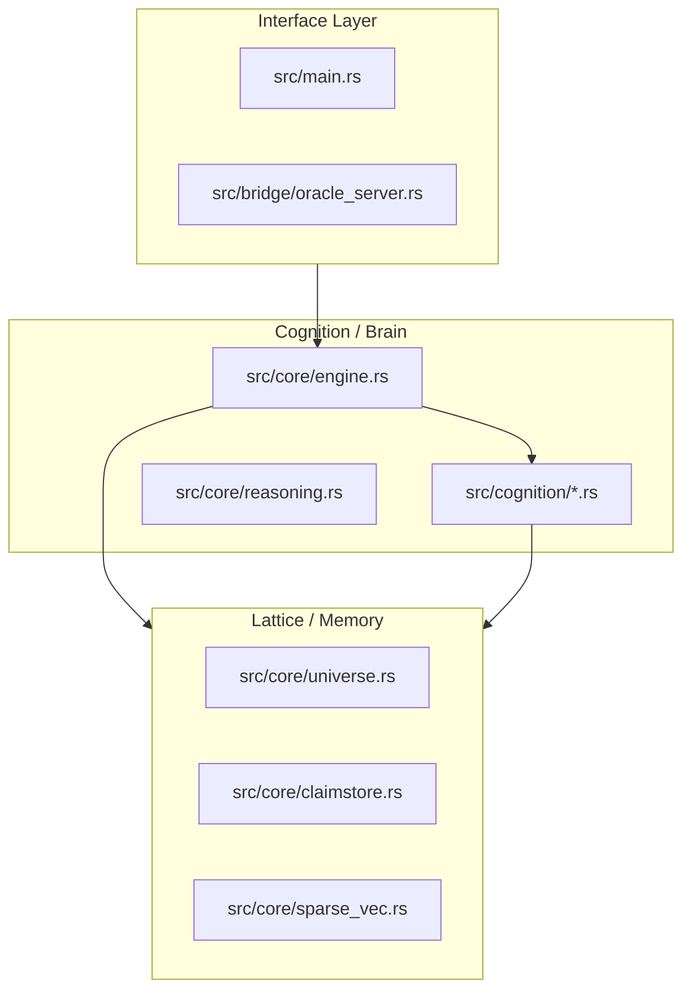

# KAI Architecture Blueprint (v6.0.0)

## 1. System Overview

KAI is structured as a decoupled cognitive engine where the "Brain" (Engine) is separate from the "Body" (TUI/Oracle).

## 2. Core Cognition Components (`src/core/`)

- **Engine**: The central orchestrator. It manages the heartbeat, dispatches tasks to cognitive modules, and handles the flow between memory and voice.
- **Universe**: The primary high-dimensional storage for belief cells. Handles geometric resonance queries.
- **ClaimStore**: v6.0.0 addition for structured epistemic memory. Tracks evidence, confidence, and contradiction.
- **SparseVec**: Vector Symbolic Architecture (VSA) implementation. Optimized with AVX2 SIMD and cached norms.
- **MindFrame**: Semantic router that manages memory regions (Self, Personal, World, Narrative).

## 3. Cognition Modules (`src/cognition/`)

Contains 81 specialized modules modeling biological brain functions:
- **Limbic**: `amygdala.rs`, `hippocampus.rs`, `insula.rs`, etc.
- **Prefrontal**: `pfc.rs`, `mpfc.rs`, `acc.rs`, etc.
- **Monoamines**: `dopamine.rs`, `serotonin.rs`, `norepinephrine.rs`, etc.
- **Integration**: `global_workspace.rs`, `dmn.rs`, `self_state_hub.rs`.

## 4. Bridge & Hardware Layer (`src/bridge/`, `src/streams/`)

- **OracleServer**: WebSocket gateway for real-time diagnostics and AI collaboration.
- **Hardware Streams**: Native drivers for CPU, GPU, and RAM communication.

## 5. Interaction Flow (v6.0.0)

1. **Input**: User speaks via TUI.
2. **Analysis**: Engine routes query through MindFrame.
3. **Retrieval**: Universe/ClaimStore performs resonant scan.
4. **Epistemic Check**: Contradiction module verifies consistency.
5. **Synthesis**: Reasoner and Modules produce a weighted field state.
6. **Voice**: Ollama or Lattice-raw articulates based on coherence gating.
7. **Heartbeat**: Engine consolidates results and updates self-state.

---

## 6. Implementation Roadmap Status

- **✓ Decoupling**: Engine core fully separated from TUI.
- **✓ Performance**: Hardware-native SIMD throughput achieved.
- **✓ Epistemic**: Claim-based memory substrate live.
- **✓ Diagnostics**: Oracle server and AI council live.
- **⏳ Awakening**: Phase 6 Self-Dialogue in progress.
