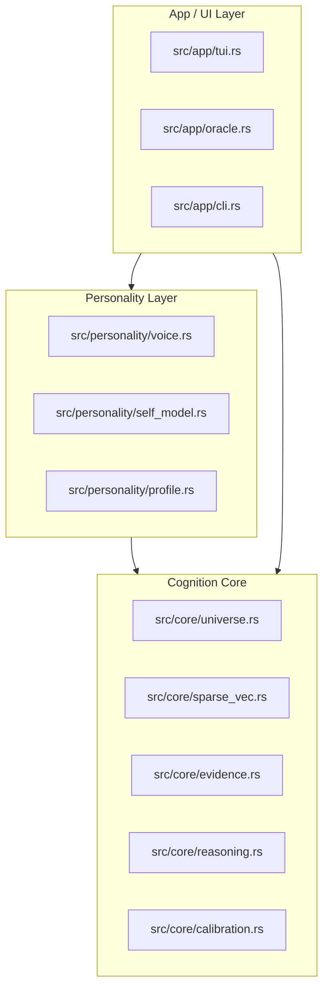

# KAI Architecture Blueprint

## 1. Layered Model

## 2. Core Cognition Components (`src/core/`)

- **Universe**: The primary high-dimensional storage for belief cells. Handles queries and pruning.
- **SparseVec**: Vector Symbolic Architecture (VSA) implementation. Handles binding, bundling, and similarity.
- **Evidence**: Tracking provenance and support/contradiction links for every claim.
- **Reasoning**: The logical processing unit that consumes Universe data to produce structured inferences.
- **Calibration**: The "evaluator" that assigns confidence scores based on evidence and consistency.

## 3. Personality Components (`src/personality/`)

- **Voice**: The bridge to LLMs (Ollama) that renders Core reasoning into a specific tone and style.
- **Self-Model**: The internal representation of KAI's identity and state.
- **Profile**: The persistent data about the user (Ryan) and relationship history.

## 4. Interaction Flow

1. **Input**: User speaks via TUI.
2. **Analysis**: Core identifies the claims/questions.
3. **Retrieval**: Universe finds related facts, claims, and hypotheses.
4. **Verification**: Evidence layer checks for support/contradiction.
5. **Inference**: Reasoning engine produces a structured result (Confidence, Evidence, Answer).
6. **Persona**: Voice renders the result into KAI's character.
7. **Output**: Displayed to user.

---

## 5. Implementation Roadmap

### Phase 1: The Great Extraction
- Move `Universe` and `SparseVec` to `src/core/`.
- Decouple `Universe` from cognitive modules (amygdala, dmn, etc.) which should be part of the `personality` or `system` layer.
- Shrink `main.rs` to < 500 lines.

### Phase 2: Typed Memory
- Update `Cell` struct in `universe.rs` to include a `Type` enum and an `Evidence` list.

### Phase 3: The Evaluation Harness
- Implement the `eval` command to measure truth accuracy and retrieval precision.
