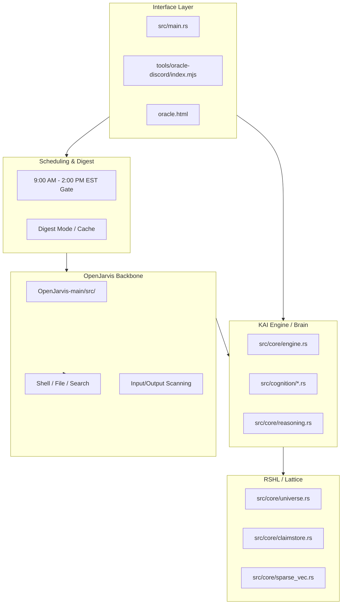

# Open Oracle Architecture Blueprint (v6.5.0)

## 1. System Overview

Open Oracle is structured as a decoupled, multi-layered cognitive ecosystem. The "Brain" (KAI & RSHL) is separate from the "Body" (OpenJarvis orchestration) and the "Mouth" (Discord/Web interfaces).

## 2. Layer 1: KAI Core Cognition (`src/core/` & `src/cognition/`)

- **Engine**: The central orchestrator for the Rust cognitive brain. Manages the heartbeat, dispatches tasks to 81 biological cognitive modules.
- **RSHL Universe**: The primary high-dimensional storage for belief cells. Handles geometric resonance queries across 16,384 dimensions. Includes the **Boid Engine** for autonomous lattice clustering.
- **ClaimStore**: Structured epistemic memory. Tracks evidence, confidence, and contradiction parameters.
- **SparseVec**: Vector Symbolic Architecture (VSA) implementation. Optimized with AVX2 SIMD.
- **MindFrame**: Semantic router that manages memory regions (Self, Personal, World, Narrative).

## 3. Layer 2: OpenJarvis Agentic Backbone (`OpenJarvis-main/`)

OpenJarvis provides the fundamental ReAct loop and tool execution pathways.
- **Agentic Orchestration**: Python-based task planning and multi-step execution.
- **Memory Bridge**: Connects directly to KAI's RSHL memory space. Now includes **Adjustment Dials** (Phi/Chi) pulling live telemetry from the KAI core.

## 4. Layer 3: Discord & Web Interfaces (`tools/oracle-discord/`)

- **Oracle Discord Gateway**: Node.js service managing 7 distinct AI agents.
- **Temporal Gating**: Restricts active operations to working hours (9 AM - 2 PM EST). Off-shift interactions are cached for morning digestion.
- **Per-User Transcripts**: Secure, isolated Discord channels automatically created for private sessions.
- **Analyst Hierarchy**: Strict permission gating ensuring the Analyst role only accepts tasks from Oracle, Ryan, or NasterModx.

## 5. Interaction Flow (v6.3.0)

1. **Gating**: Input is checked against working hours. If closed, data enters **Digest Mode**.
2. **Identification**: Participant identity (Ryan, NasterModx, etc.) is persisted through the loop.
3. **Orchestration**: OpenJarvis receives the input and determines if tool use is required.
4. **Analyst Check**: If targeting the Analyst, a hierarchy check verifies authorization.
5. **Retrieval**: KAI Engine scans the RSHL Universe for resonant claims.
6. **Synthesis**: The active agent formulates a response based on the weighted field state.
7. **Wake-up Routine**: At 9:00 AM, the KAI Engine autonomously processes the previous night's digest cache.
