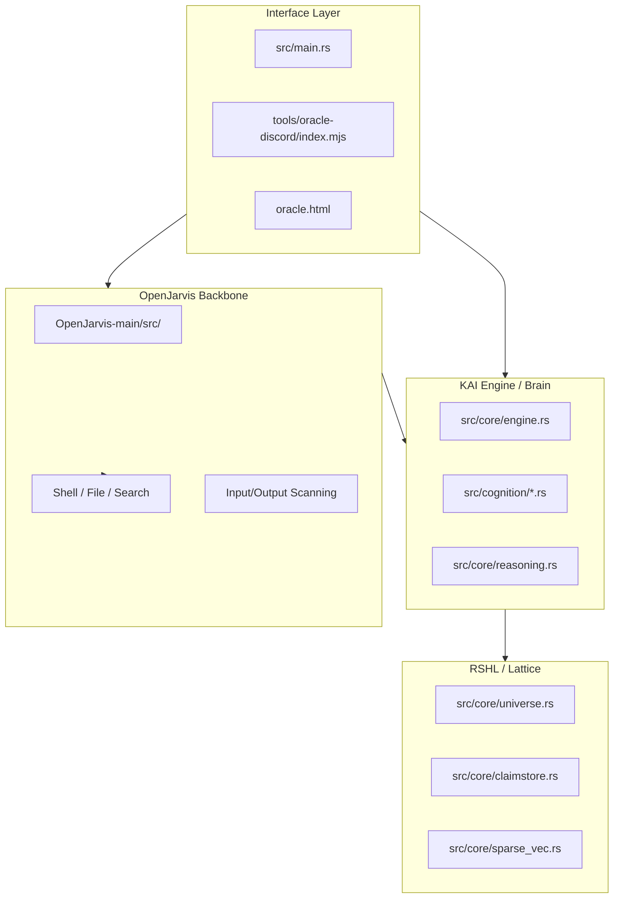

# Open Oracle Architecture Blueprint (v6.1.1)

## 1. System Overview

Open Oracle is structured as a decoupled, multi-layered cognitive ecosystem. The "Brain" (KAI & RSHL) is separate from the "Body" (OpenJarvis orchestration) and the "Mouth" (Discord/Web interfaces).

## 2. Layer 1: KAI Core Cognition (`src/core/` & `src/cognition/`)

- **Engine**: The central orchestrator for the Rust cognitive brain. Manages the heartbeat, dispatches tasks to 81 biological cognitive modules.
- **RSHL Universe**: The primary high-dimensional storage for belief cells. Handles geometric resonance queries across 16,384 dimensions.
- **ClaimStore**: Structured epistemic memory. Tracks evidence, confidence, and contradiction parameters.
- **SparseVec**: Vector Symbolic Architecture (VSA) implementation. Optimized with AVX2 SIMD and cached norms for sub-millisecond similarity scans.
- **MindFrame**: Semantic router that manages memory regions (Self, Personal, World, Narrative).

## 3. Layer 2: OpenJarvis Agentic Backbone (`OpenJarvis-main/`)

OpenJarvis provides the fundamental ReAct loop and tool execution pathways for Open Oracle.
- **Agentic Orchestration**: Python-based task planning and multi-step execution.
- **Tools**: Execution environment for shell commands, code generation, web searching, and file manipulation.
- **Memory Bridge**: Connects directly to KAI's RSHL memory space so all agents share the same grounded reality.

## 4. Layer 3: Discord & Web Interfaces (`tools/oracle-discord/`)

- **Oracle Discord Gateway**: Node.js service managing 7 distinct AI agents (Open Oracle, KAI, Leo, Gemini, X, Analyst, Researcher, Groq).
- **Voice Council**: Live voice integration using ElevenLabs Scribe and TTS for agents like Leo.
- **Diagnostic UI**: WebSocket gateway (`oracle.html`) for real-time visualization of the cognitive lattice and agentic approval gates.

## 5. Interaction Flow (v6.1.1)

1. **Input**: User speaks via Discord, Web, or TUI.
2. **Orchestration**: OpenJarvis receives the input and determines if tool use is required.
3. **Retrieval**: KAI Engine scans the RSHL Universe for resonant claims.
4. **Epistemic Check**: Contradiction module verifies consistency of the retrieved memories.
5. **Synthesis**: The active agent formulates a response based on the weighted field state.
6. **Voice**: Ollama, OpenAI, or Groq articulates the response.
7. **Heartbeat**: Engine consolidates the interaction into the long-term RSHL lattice.
