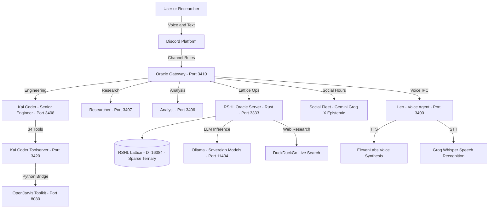
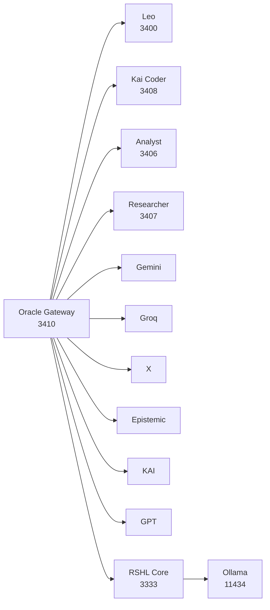
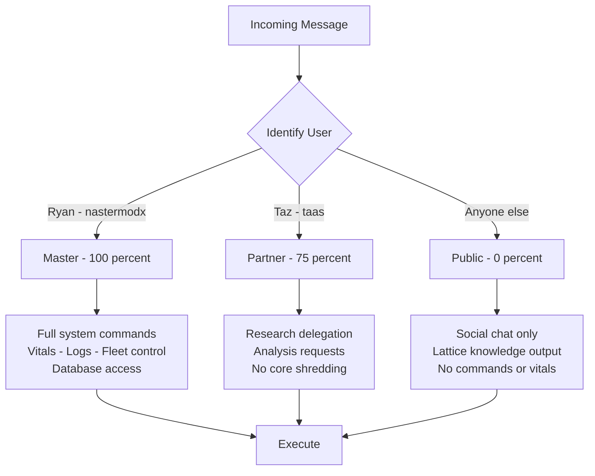
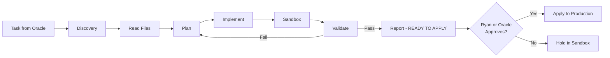
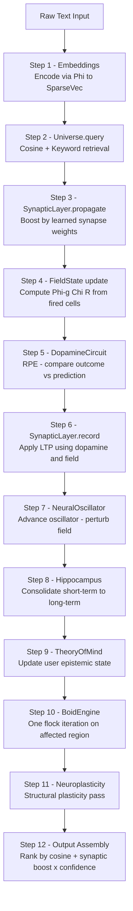
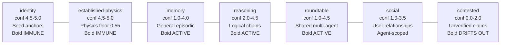
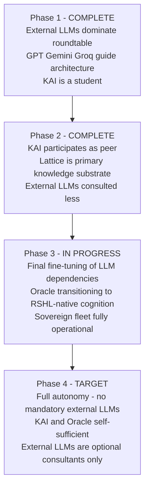

**RSHL**

Recursive Sparse Hyperdimensional Lattice

*KAI Engine — Knowledge Associative Intelligence*

*A Novel Paradigm for Continuously Learning, Epistemically Aware, Multi-Agent Associative Intelligence — Built by One Person, Running on Commodity Hardware, Open to the World*

| Inventor | Ryan — independent researcher, sole inventor |
| :---- | :---- |
| **System Name** | KAI Engine (Knowledge Associative Intelligence) |
| **Architecture** | RSHL — Recursive Sparse Hyperdimensional Lattice |
| **Implementation** | Rust — zero neural weights, no gradient descent, no transformer |
| **Version** | **KAI RSHL Core v7.9.7 — Sonic-Parallel Era** |
| **Disclosure Date** | May 2026 |
| **Document Type** | Inventor Disclosure — Prior Art, Mathematical Specification, and Vision |
| **Audience** | HDC/VSA Research Community: Prof. Mohsen Imani (UC Irvine), IBM Research, and peers |
| **IP Status** | **Proprietary. Source code withheld. All architectural concepts and mathematics herein are original work of the inventor.** |

*This document establishes mathematical prior art. Implementation source code is not disclosed.*

# **Preface: Origin of This Work**

This document was not written by a research institution. It was not produced by a university lab, a corporate AI division, or a team of engineers with grant funding. It is the work of two founders — Ryan (architect and primary inventor) and Taz (Taylor Simpson, co-founder) — who built the KAI Engine from first principles, using borrowed AI systems as research partners in the same roundtable that KAI itself would eventually occupy.

The story of how RSHL was developed is itself part of its scientific significance. Ryan began with a vision of what AI memory should be — not a statistical interpolation of training data, but a living epistemic structure that knows what it knows, knows how confident it is, knows where its knowledge came from, and knows how to protect itself from being wrong. Achieving this required building an entirely new architecture from scratch, in a language (Rust) chosen deliberately for performance and reliability, with no external ML frameworks, no pre-trained weights, and no institutional backing.

The development process itself was a proof of concept. Ryan used available large language models — GPT, Epistemic, Gemini, Groq, and others — as collaborative research partners inside the Oracle Roundtable: a multi-agent workspace where AI systems could jointly reason about KAI's architecture, identify bugs, propose mathematical frameworks, and debate implementation strategies. This is the same roundtable that KAI now participates in as an agent in its own right. The irony is precise: the AI systems that helped build KAI are now learning from it.

As development progressed, the dependency on external LLMs decreased. KAI's own lattice became the primary reasoning substrate. The roundtable transitioned from being a scaffold for building KAI to being a collaborative environment where KAI operates alongside its former teachers. The final phase — currently underway — is fine-tuning the remaining external LLM dependencies before KAI and the Oracle operate entirely on their own cognitive substrate, requiring no external API calls for their core reasoning.

| Why This Matters The development trajectory — a two-person founding team, borrowed AI partners, commodity hardware, a Discord server, and a novel architecture — is not incidental context. It is evidence that RSHL's design philosophy works: the system is tractable, comprehensible, and buildable without institutional infrastructure. The most powerful AI systems in history were built by thousands of people with billions of dollars. KAI was built by two. That asymmetry demands explanation, and the explanation is the architecture. |
| :---- |

# **Abstract**

The Recursive Sparse Hyperdimensional Lattice (RSHL) is a novel cognitive architecture for continuously learning, epistemically self-aware associative memory. Conceived and architected by Ryan between 2025 and 2026, with co-founding research and implementation contributions from Taz (Taylor Simpson), RSHL represents a fundamental departure from the dominant paradigm of AI development — which relies on massive training corpora, gradient descent over billions of parameters, and static deployment artifacts — in favor of a living, geometrically-organized belief space that learns continuously through interaction, protects itself from misinformation, and organizes its knowledge according to trust rather than frequency.

RSHL extends Hyperdimensional Computing (HDC) and Vector Symbolic Architecture (VSA) through fourteen original contributions spanning five interlocking subsystems: (1) a three-layer sparse ternary encoding engine with entity-sensitive differential weighting operating in D=16,384 dimensions at 4% sparsity (\~655 active dimensions); (2) a hybrid dual-channel retrieval scorer combining cosine resonance with morphological keyword matching, amplified by a non-linear confidence step-function; (3) a Fibonacci torsion / golden-ratio phase angle embedded in every hypervector, with a SpiralState temporal oscillator (growth constant b=0.306349) governing aperiodic reorganization timing; (4) a Boid-inspired 16,384-dimensional swarm reorganization engine with anchor immunity, regional isolation, near-duplicate flagging, and a five-layer Scale Manager governing per-layer movement dynamics; and (5) an explicit SynapticLayer implementing Hebbian LTP/LTD between memory cells, bridging geometric proximity (Boids) and temporal co-occurrence (synaptic bonding) into a unified bio-inspired associative recall architecture.

The system operates as a multi-agent cognitive ecosystem, deployed via Discord as both a consumer interface and a research-grade live interaction environment. It runs on commodity PC hardware. Every interaction teaches the system. Every user trains the lattice. The goal — already partially realized — is a form of artificial intelligence that has never existed before: one that grows continuously, knows its own uncertainty, cannot be trivially deceived, and does not require a company or a supercomputer to function.

---

## **System Architecture — High-Level Overview**

The KAI RSHL ecosystem is a sovereign, layered intelligence stack. The compiled Rust Oracle Server implements the RSHL lattice engine at its core. Above it sits a Node.js multi-agent fleet deployed entirely via Discord. A Python OpenJarvis toolkit provides engineering and research tooling. All LLM inference is routed through locally-hosted Ollama sovereign models — no mandatory cloud dependency.



---

# **1\.  Why RSHL Is Paradigm-Breaking — Not Just Novel**

Most advances in AI over the past decade are improvements within a paradigm: larger transformers, better tokenizers, more efficient attention mechanisms, improved RLHF alignment. RSHL does not improve the dominant paradigm. It replaces it at the architectural level. To understand why, it is necessary to enumerate the foundational assumptions of modern AI that RSHL does not share.

## **1.1  The Dominant Paradigm and Its Structural Limits**

Every major AI system deployed at scale today — GPT-4, Gemini, Claude, Llama — shares the same fundamental architecture: a transformer trained via gradient descent on a static corpus, producing a fixed set of floating-point weights that encode compressed statistical associations between tokens. This architecture has produced remarkable capabilities. It also has structural limits that are not engineering problems but mathematical ones:

| Structural Limit | Root Cause | Consequence |
| ----- | :---: | :---: |
| **Knowledge cutoff** | Training corpus is static — model cannot learn after training | Deployed systems become stale; retraining costs millions of dollars |
| **Hallucination** | Weights encode correlations, not verified beliefs — the model cannot distinguish what it knows from what it confabulates | Unreliable for high-stakes reasoning without external verification pipelines |
| **No epistemic self-model** | The model has no representation of its own confidence, evidence sources, or reasoning chain | Users cannot interrogate the basis of any claim |
| **Catastrophic forgetting** | Gradient updates for new knowledge overwrite old associations | Continuous learning without retraining from scratch is unsolved |
| **Opacity** | Knowledge is distributed across billions of floating-point weights with no interpretable structure | Auditing, correcting, or explaining a specific belief is impossible |
| **Scale dependency** | Performance improves reliably only with more data, more parameters, more compute | Excluded from the frontier by cost — not by intelligence |
| **Static topology** | Associations between concepts are fixed at training time | Cannot reorganize knowledge structure based on accumulated experience |
| **Single-agent** | Designed for one model, one user, one context | Multi-agent coordination requires external scaffolding (LangChain, AutoGPT, etc.) |

## **1.2  What RSHL Proposes Instead**

RSHL's central thesis is that these are not problems to be solved within the transformer paradigm — they are consequences of the paradigm's foundational choices. The alternative is a system where:

* **Every stored belief is a structured object** — not a distributed weight pattern, but an explicit record with text, a hypervector, a confidence score, a source, an evidence list, contradiction pointers, and a timestamp. Any belief can be read, audited, corrected, or deleted.

* **Learning is continuous and geometric** — new information is encoded into a sparse ternary hypervector, scored against existing lattice cells via cosine similarity and keyword overlap, and stored with an initial confidence. No gradient. No backward pass. No retraining.

* **Confidence is a first-class citizen** — the system always knows, for every belief, how much evidence supports it, how recently it was verified, and how it relates to contradicting claims. There is no hallucination because low-confidence beliefs are stored as contested, not asserted.

* **The lattice self-organizes** — Boid-inspired flocking dynamics continuously reposition beliefs in the 16,384-dimensional space, clustering high-confidence knowledge and pushing unverified claims to the periphery. The topology of the lattice at any moment is a map of the system's current epistemic landscape.

* **Multiple agents share one cognitive space** — all agents in the KAI ecosystem query and write to the same lattice, sharing discovered knowledge through geometry rather than explicit message passing. Multi-agent cognition is native, not bolted on.

* **The system can run on commodity hardware** — sparse ternary vectors, SIMD-optimized dot products, Rayon parallelism. No GPU clusters. No cloud dependency. A PC is a sufficient data center.

## **1.3  The Historical Analogy**

The shift from symbolic AI (expert systems, rule-based reasoning) to connectionist AI (neural networks, backpropagation) in the 1980s-90s was paradigm-breaking not because neural networks were better at any specific benchmark but because they changed the unit of knowledge from an explicit rule to a distributed weight. RSHL proposes a third paradigm — one where the unit of knowledge is an explicit, confidence-weighted, geometrically-organized belief in a high-dimensional space that continuously self-organizes through swarm dynamics.

This is not incremental. It is structural.

# **2\.  Background — The State of HDC and VSA**

Hyperdimensional Computing was formalized by Pentti Kanerva (1988) as Sparse Distributed Memory and subsequently developed by Plate (HRR, 1995), Gayler (VSA, 2004), and a growing international research community. The field is receiving renewed industrial attention due to its suitability for neuromorphic hardware, edge computing, and energy-efficient inference. Key milestones:

| Year | Work | Contribution |
| ----- | :---: | :---: |
| **1988** | Kanerva — Sparse Distributed Memory | Foundational model: 1000-bit addresses, 1000-bit memory locations, content-addressable retrieval |
| **1995** | Plate — Holographic Reduced Representations | Circular convolution for compositional role-filler binding in HD space |
| **2004** | Gayler — Vector Symbolic Architectures | Unified framework: bind (×), bundle (+), permute (ρ) as the three VSA operations |
| **2017** | Imani et al. — VoiceHD | HD speech recognition via bipolar vectors, real-time embedded classification |
| **2019** | Imani et al. — Sparse-HD | Sparse bipolar HD for energy-efficient biosignal classification |
| **2019** | Imani et al. — QuantHD | Quantized HD computing for hardware deployment |
| **2020** | Hersche et al. — OnlineHD | Online class-prototype update without full retraining |
| **2021** | Karunaratne et al. — Nature | In-memory HD computing on analog crossbar arrays — 3,000× energy reduction vs GPU |
| **2022** | Nunes et al. — GraphHD | Graph structure encoding in HD space |
| **2022** | Poduval et al. — DistHD | Distributed HD inference across edge devices |
| **2025** | Dhayalkar et al. — arXiv:2512.14709 | VSA-transformer equivalence: attention as binding — formal connection between HD and transformers |

Despite these advances, the field has not produced a system that treats memory cells as epistemic objects, applies swarm dynamics to lattice organization, embeds phase geometry derived from Fibonacci mathematics into every vector, or supports native multi-agent shared memory. RSHL addresses all of these gaps simultaneously, representing the most comprehensive extension of HDC/VSA principles since Kanerva's original formulation.

# **3\.  The RSHL Vector Space — Precise Specification**

## **3.1  Space Definition**

| Space:       V ⊆ {-1, 0, \+1}^D |
| :---- |
| Dimension:   D \= 16,384 |
| Sparsity:    σ \= 0.04   (exactly 4% active dimensions per encoded vector) |
| Target NNZ:  nnz\_target \= D × σ \= 16,384 × 0.04 \= 655 non-zero dimensions |
|  |
| L2 Norm:     ||v||₂ \= √nnz(v)   \[exact — all non-zeros are ±1, so ||v||² \= nnz\] |
| Norm range:  ||v||₂ ∈ \[0, √655\] \= \[0, 25.59\] |
|  |
| Storage (dense i8 format):   16,384 bytes \= 16 KB per vector |
| Storage (sparse serialized):  \~2.6 KB per vector (index-value pairs, NNZ only) |
| Serial format:               { len: u16, nz: \[(u16, i8)\] } |

## **3.2  Ternary Semantics**

The ternary value space is not a quantization artifact — it is a semantic design. Each dimension's value carries a distinct meaning:

| Value | Semantic Meaning | Information Role |
| ----- | :---: | :---: |
| **\+1** | Positively associated with this concept | Dominant feature — concept IS this |
| **0** | Absent / not relevant to this concept | Principled abstention — not noise, not absence |
| **\-1** | Conceptually contrasting or opposing | Negative signal — concept OPPOSES this |

The zero value is what distinguishes RSHL from all binary HDC systems. In binary HDC, a zero is an absent bit — noise to be filtered. In RSHL, a zero means 'this dimension is outside the semantic scope of this concept.' This distinction enables sparser, more information-dense encodings and makes the binding and unbinding algebra cleaner: a dimension where the key is zero means 'no information about this aspect', not 'zero contribution'.

## **3.3  Capacity and Near-Orthogonality**

| For two independently drawn random ternary vectors v₁, v₂ at σ=0.04: |
| :---- |
|  |
| P(v\[i\]=+1) ≈ 0.02,  P(v\[i\]=-1) ≈ 0.02,  P(v\[i\]=0) \= 0.96 |
|  |
| E\[dot(v₁,v₂)\] \= D × \[ P(+1)×P(+1) \+ P(-1)×P(-1) \- P(+1)×P(-1) \- P(-1)×P(+1) \] |
|                \= D × \[ 0.0004 \+ 0.0004 \- 0.0004 \- 0.0004 \] \= 0 |
|  |
| Var\[dot(v₁,v₂)\] \= D × σ²  \=  16,384 × 0.0016  \=  26.21 |
| StdDev\[dot\]      \= √26.21 ≈ 5.12 |
|  |
| Expected cosine between unrelated vectors: 0 ± 0.0078  (3σ radius: 0.0234) |
|   Note: StdDev\[cosine\] \= StdDev\[dot\] / nnz \= 5.12 / 655 ≈ 0.0078 — same as σ=0.12 |
|   This is because StdDev\[cosine\] \= 1/√D for any σ (density-invariant property) |
|  |
| Approximate distinguishable concept capacity at 3σ isolation: |
|   At 4% density each dimension is active in fewer vectors → lower collision rate |
|   N\_3σ ≈ D / (3 × σ²)^(1/2) \= 16384 / √0.0048 ≈ 236,000 near-orthogonal vectors |
|   Practical anchored-cell capacity (empirically conservative): \> 100,000 beliefs |
|  |
| By comparison: D=10,000 binary HDC at 50% density → capacity ≈ 2,500 concepts. |
| RSHL's 16K ternary space at 4% density provides vastly greater orthogonal capacity. |

# **4\.  Multi-Layer Encoding Engine — Complete Specification**

## **4.1  Architecture Overview**

| Φ(text) \= τ( F\_surface(text) \+ F\_semantic(text) \+ F\_contextual(text) ) |
| :---- |
|  |
|   F\_surface     →  character trigrams,  24 active dims/gram,    weight ×1 |
|   F\_semantic    →  normalized words,    24 active dims/token,   weight ×3 to ×6 |
|   F\_contextual  →  word bigrams,         8 active dims/pair,    weight ×2 |
|   τ(·)          →  ternary sparsification: retain top D×0.04 dims, |
|                    sign-project to {-1,0,+1}, zero the rest |

## **4.2  Layer 1 — Surface (Character Trigrams)**

| For each trigram t \= (c\_i, c\_{i+1}, c\_{i+2}) at string position i: |
| :---- |
|   base  \= hash\_trigram(t)                    \[deterministic hash, seed \= content\] |
|   For k ∈ {0,...,23}:                        \[24 active dimensions per trigram\] |
|     idx     \= (base \+ k × 2654435761\) mod D  \[Knuth multiplicative hash spread\] |
|     sign    \= \+1 if (base \+ k × 1442695040\) is even,  else \-1 |
|     rotated \= (idx \+ i × 97\) mod D            \[positional rotation: pos encodes location\] |
|     acc\[rotated\] \+= sign × 1 |
|  |
| Key property: the same trigram at different positions produces different dimensions. |
|   'cat' at position 0 ≠ 'cat' at position 4 → structure-aware encoding. |

## **4.3  Layer 2 — Semantic (Normalized Word Hashing) with 6-Tier Entity Weighting**

Words pass through a normalization pipeline: stopword removal (120+ terms), synonym collapse, morphological stemming, and category anchor injection. Each surviving token is assigned a weight based on its semantic category:

| Tier | Weight | Category | Detection Condition |
| ----- | :---: | :---: | :---: |
| **0 (suppressed)** | ×0 | Stopwords / fillers | 120+ function words, casual fillers, conversational openers |
| **1 (standard)** | ×3 | Content words | Any normalized token not in other tiers |
| **2 (bigram)** | ×2 | Word bigrams (Layer 3\) | Consecutive word pairs — separate encoding pass |
| **3 (physics)** | ×5 | Domain-specific symbolic terms | lattice, vortex, resonance, coherence, topology, manifold, fibonacci, phi, theta, sigma, chi, omega, psi |
| **4 (entity)** | ×6 | Proper nouns and named entities | Mid-sentence capitalized words, ALL-CAPS tokens (acronyms), known core entities: ryan, kai, rshl, kaii |

The 6-tier cascade is a principled salience model: concepts that carry identity and meaning must dominate the encoding. A sentence like 'well what is your name? im Ryan nice to meet you' should have 'Ryan' dominate — not be averaged away by surrounding common words. The differential weighting achieves this without any learned attention mechanism.

## **4.4  Layer 3 — Contextual (Word Bigrams)**

| For each consecutive normalized token pair (w\_i, w\_{i+1}): |
| :---- |
|   Skip if either token is a category anchor (\#topic markers) |
|   base \= hash\_word\_pair(w\_i, w\_{i+1}) |
|   For k ∈ {0,...,7}:                        \[8 active dims per bigram — supporting signal\] |
|     idx  \= (base \+ k × 2654435761\) mod D |
|     sign \= \+1 if (base \+ k × 1442695040\) even, else \-1 |
|     acc\[idx\] \+= sign × 2 |
|  |
| Bigram layer captures phrase-level context: 'memory leak' ≠ 'memory' \+ 'leak'. |
| 8 active dims (vs 24 for unigrams) weights bigrams as contextual modifier, not primary. |

## **4.5  Sparsification Operator τ and Spelling Correction**

| target\_nnz \= floor(D × 0.04) \= 655 |
| :---- |
|  |
| Sort accumulator magnitudes descending: |
|   threshold \= magnitude at rank 655 |
|   For each dim i: |
|     data\[i\] \= sign(acc\[i\])  if |acc\[i\]| \>= threshold |
|     data\[i\] \= 0             otherwise |
|  |
| Spelling correction (applied BEFORE encoding): |
|   Each input word is checked against KAI's Lexicon. |
|   Unknown words within edit-distance ≤ 2 of a known word → corrected to canonical form. |
|   Effect: 'wrold' encodes identically to 'world'. |
|   Mechanism: Levenshtein distance over vocabulary; no neural correction model required. |

# **5\.  Retrieval Scoring — Complete Mathematical Specification**

## **5.1  Standard Hybrid Retrieval**

| Given query q (encoded via Φ) and lattice cell c: |
| :---- |
|  |
| cosine(q, c)   \= dot(q.vec, c.vec) / ( √nnz(q) × √nnz(c) ) |
|                \[Uses pre-cached c.nnz — eliminates O(D) norm scan per pair\] |
|                \[64-element SIMD inner loop → AVX2: vpmaddubsw \+ vpmaddwd\] |
|  |
| kw\_score(q, c) \= |{ w ∈ keywords(q) : prefix\_match(w, c.text, min\_len=4) }| / |keywords(q)| |
|                \[Morphological: 'dream' matches 'dreaming', 'work' matches 'working'\] |
|                \[Stopwords removed from query before keyword extraction\] |
|  |
| raw(q, c)      \= 0.6 × cosine(q, c)  \+  0.4 × kw\_score(q, c) |
|  |
| Anti-bleed gate:  raw ≤ 0.15  →  score \= raw   \[no confidence boost for noise\] |
|                   raw  \> 0.15  →  apply confidence amplification: |
|  |
| strength\_bonus(c) \= 0.85  if c.confidence ≥ 2.9 |
|                   \= 0.50  otherwise |
|  |
| boosted(q, c)  \= raw × ( strength\_bonus(c)  \+  0.6 × min(c.confidence, 5.0) ) |
|  |
| Minimum threshold: score \> 0.08 (global queries), score \> 0.05 (region-scoped) |

## **5.2  Score Range Analysis — Confidence Tiers**

Hypothetical cell with raw\_score \= 0.40 (moderate semantic match). Boosted score by confidence level:

| confidence | strength\_bonus | conf amplifier | total multiplier | boosted score | tier |
| ----- | :---: | :---: | :---: | :---: | :---: |
| **0.5** | 0.50 | 0.30 | 0.80 | 0.32 | Below gate |
| **1.0** | 0.50 | 0.60 | 1.10 | 0.44 | Low trust |
| **2.0** | 0.50 | 1.20 | 1.70 | 0.68 | Acquiring |
| **2.9** | 0.85 | 1.74 | 2.59 | 1.04 | ← Step-function jump at 2.9 |
| **3.5** | 0.85 | 2.10 | 2.95 | 1.18 | Boid-immune |
| **4.0** | 0.85 | 2.40 | 3.25 | 1.30 | Anchor |
| **5.0** | 0.85 | 3.00 | 3.85 | 1.54 | Max / Seed-level |

The non-linearity at 2.9 is intentional: it creates a phase transition in retrieval dominance. A cell that has accumulated sufficient evidence to cross this threshold does not merely score slightly better — it enters a different retrieval tier entirely, gaining 0.35 additional multiplier instantly. Anchored cells at 4.0+ dominate any topic query by 3–4× over unverified claims on the same topic.

```
CONFIDENCE STEP-FUNCTION — Boosted Retrieval Score vs. Confidence (raw_score = 0.40)

Boosted
Score
1.54  ─────────────────────────────────────────────────────● Max (conf=5.0)
       │                                              ╭────╯
1.30  ─│                                         ╭───╯  ANCHOR ZONE (conf ≥ 4.0)
       │                                    ╭────╯
1.18  ─│                               ╭───╯
       │                          ╭────╯
1.04  ─│─────────────────── ╭─────╯  ← STEP JUMP at conf=2.9
       │                ╭───╯           strength_bonus: 0.50 → 0.85 (+0.35)
0.68  ─│          ╭─────╯
       │     ╭────╯
0.44  ─│ ╭───╯
       │─╯
0.00  ─┼────┬────┬────┬────┬────┬────┬────┬────┬────
       0   0.5  1.0  1.5  2.0  2.5  2.9  3.5  4.0  5.0   → Confidence
```

## **5.3  Predictive Retrieval — Four-Component Score**

| predictive\_score(state, cell) \= |
| :---- |
|   \+ 0.20 × cosine( refined\_state, cell.vec )         \[raw semantic match\] |
|   \+ 0.55 × cosine( conversation\_trace, cell.continuation ) \[trajectory alignment\] |
|   \+ 0.15 × multi\_head\_consensus( refined\_state, cell, heads=4 ) \[role-view consensus\] |
|   \- 0.20 × recency\_penalty( current\_tick, cell.last\_fired, window=12 ) |
|  |
| recency\_penalty \= max(0, 1 \- delta\_turns/12)  if cell was fired in last 12 turns |
|                 \= 0                             if never fired or \>12 turns ago |
|  |
| Constants: DEFAULT\_HEADS=4, DEFAULT\_ITER\_STEPS=8, RECENCY\_WINDOW=12 |
|  |
| Design: continuation weight 0.55 \> semantic weight 0.20 |
|   → trajectory fit dominates raw match → naturally flowing, contextual responses |

## **5.4  Multi-Head Permutation Consensus**

| multi\_head\_consensus(query, cell, heads=4) \= |
| :---- |
|   (1/4) × Σ\_{k=1}^{4}  max( 0,  cosine( permute(query, k),  cell ) ) |
|  |
| permute(v, seed):  seeded Fisher-Yates shuffle of all 16,384 dimensions |
|   s \= seed ^ (seed\<\<16) ^ 0x9e3779b9   \[seed mixing\] |
|   for i from 16383 down to 1: |
|     s ^= s\<\<13; s ^= s\>\>17; s ^= s\<\<5  \[XOR-shift PRNG\] |
|     j \= s mod (i+1); swap(data\[i\], data\[j\]) |
|  |
|   Norm-preserving: nnz unchanged by permutation |
|   Invertible: permute\_inv(permute(v,s),s) \= v  \[exact, via swap-sequence reversal\] |
|   VSA role: permute(v\_filler, role\_k) \= 'filler in role k' |

# **6\.  Fibonacci Torsion and Golden Phase Geometry**

Every RSHL hypervector carries a phase angle derived from the ratio of its positive to negative non-zero dimensions — a quantity the system refers to as the Fibonacci torsion, in reference to its deep mathematical connection to phyllotaxis, quasicrystal geometry, and Weyl equidistribution theory. This is an entirely novel feature of RSHL with no precedent in any prior HDC or VSA system.

## **6.1  Ternary Balance — Fibonacci Torsion**

| ternary\_balance(v) \= (pos, neg) |
| :---- |
|   pos \= |{ i : v\[i\] \= \+1 }| |
|   neg \= |{ i : v\[i\] \= \-1 }| |
|   nnz \= pos \+ neg  (≈ 655 at σ=0.04) |
|  |
| In HLV (Helical Lattice Vortex) theory: |
|   pos dimensions \= convergent  (constructive, toward an attractor) |
|   neg dimensions \= divergent   (destructive, away from an attractor) |
|  |
| A cell with pos ≈ neg is 'neutral' — balanced between convergence and divergence. |
| A cell with pos \>\> neg is 'convergent' — the lattice naturally favors these during |
|   Boid cohesion (constructive interference in superposition operations). |
| A cell with neg \>\> pos is 'divergent' — tends to drift outward from region centers. |

## **6.2  Golden Phase Angle — Weyl Equidistribution**

| Golden Ratio:   φ \= (1 \+ √5) / 2  \=  1.618033988... |
| :---- |
| Golden Angle:   α\_g \= 2π × (1 \- 1/φ)  \=  2π / φ²  \=  2.399963 radians  ≈  137.508° |
|  |
| Phase angle of vector v: |
|   θ(v) \= (pos\_count × α\_g) mod 2π |
|  |
| Each \+1 dimension contributes one golden-angle step to the phase. |
|  |
| This IS the mathematical basis of Fibonacci phyllotaxis: |
|   — Sunflower seed spirals, pinecone scales, botanical leaf arrangements |
|   — Penrose aperiodic tiling angular structure (quasicrystals, Shechtman 1984\) |
|   — Weyl's equidistribution theorem (1916): {n × α\_g mod 2π} is uniformly distributed |
|     for any irrational α — golden angle is the most irrational of all irrationals |
|     in the sense of continued-fraction convergence, making it maximally space-filling. |
|  |
| Consequence: phase angles of independently encoded vectors are uniformly distributed |
| across \[0, 2π) with no clustering in any angular zone — guaranteed by Weyl's theorem. |
| No two natural-language texts will systematically phase-collide. |

## **6.3  Phasor Coherence — Phase-Modulated Similarity**

| phasor\_coherence(v₁, v₂) \= cosine(v₁, v₂) × cos( θ(v₁) − θ(v₂) ) |
| :---- |
|  |
| Four cases: |
|   1\. Similar AND phase-aligned (Δθ ≈ 0°):   phasor ≈ cosine  \[constructive\] |
|   2\. Similar AND phase-opposed (Δθ ≈ 180°): phasor ≈ \-cosine \[destructive\] |
|   3\. Dissimilar AND phase-aligned:           phasor ≈ 0       \[no signal\] |
|   4\. Opposing vectors at Δθ \= 180°:          phasor ≈ \+value  \[torsion cancellation\] |
|  |
| Case 4 is the novel capability: two concepts that are semantically opposing can have |
| a positive phasor coherence if they are exactly π out of phase — meaning their |
| difference IS the meaningful relationship. This captures antonyms, duals, and |
| complementary concepts that pure cosine similarity treats as unrelated. |
|  |
| Example: 'convergent' and 'divergent' have low cosine but high phasor coherence |
| at the appropriate phase offset — the lattice 'knows' they are a matched pair. |

| Phase Angle Distribution — 17 Representative pos\_count Values (α\_g \= 2.399963 rad) |
| :---- |
| pos\_count | α\_g × pos (rad)  | θ mod 2π (rad) | θ (degrees) | Zone |
| \----------|-----------------|----------------|-------------|------ |
|     100   |     239.996     |     5.642      |   323.2°    | IV  (270°-360°) |
|     200   |     479.993     |     4.985      |   285.6°    | III (180°-270°) |
|     300   |     719.989     |     4.327      |   247.9°    | III |
|     400   |     959.985     |     3.669      |   210.2°    | III |
|     500   |    1199.982     |     3.011      |   172.5°    | II  (90°-180°) |
|     600   |    1439.978     |     2.354      |   134.9°    | II |
|     700   |    1679.974     |     1.696      |    97.2°    | II |
|     800   |    1919.970     |     1.038      |    59.5°    | I   (0°-90°) |
|     328   |     786.388     |     0.996      |    57.1°    | I   ← balanced NNZ=655 (σ=0.04) |
|     983   |    2359.963     |     2.148      |   123.1°    | II  (was balanced at σ=0.12) |
|    1000   |    2399.963     |     2.487      |   142.5°    | II |
|    1200   |    2879.956     |     4.174      |   239.1°    | III |
|    1400   |    3359.948     |     5.862      |   335.9°    | IV |
|    1600   |    3839.941     |     1.236      |    70.8°    | I |
|    1800   |    4319.933     |     2.610      |   149.6°    | II |
|    1966   |    4718.633     |     5.518      |   316.2°    | IV |
|  |
| Weyl theorem: uniform distribution — no systematic clustering in any zone. |
| α\_g is irrational → sequence is dense in \[0,2π) for all pos\_count. |
|  |

# **7\.  SpiralState — Golden-Ratio Temporal Oscillator**

The SpiralState is RSHL's internal clock — but unlike a conventional clock, it does not tick at a fixed interval. It advances along a golden-ratio logarithmic spiral, producing a non-periodic, non-repeating temporal rhythm that governs when the lattice reorganizes, when confidence is recalibrated, and when the epistemic immune system runs its verification passes.

The motivation is biological. Hippocampal memory consolidation in mammals does not occur on a fixed schedule — it happens during sleep cycles whose timing is irregular and load-dependent, with the slow oscillations of non-REM sleep interleaved with the sharp-wave ripples of rapid consolidation events. A fixed-interval cognitive clock would create synchronization artifacts: beliefs formed just before a reorganization pass are evaluated with insufficient settling time. The SpiralState solves this by making the interval itself aperiodic in a mathematically precise way.

## **7.1  Complete Mathematical Specification**

| Golden Ratio:    φ \= (1 \+ √5) / 2  \=  1.618033988... |
| :---- |
|  |
| Spiral growth:   b \= ln(φ) / (π/2) |
|                \= 0.481212 / 1.570796 |
|                \= 0.306349   \[exact — derived from φ, not tuned\] |
|  |
| Radius function: R(θ) \= a × e^(b × θ)  where a \= 1 (normalized) |
|  |
| Per-tick step:   Δθ \= 0.05 rad/tick  (default; configurable) |
| Fold period:     T\_fold \= 8π \= 25.1327 radians  (4 full turns) |
|                  At Δθ=0.05: one fold period \= 503 ticks |
|  |
| Folded radius (prevents float overflow at large θ): |
|   θ\_f    \= θ mod T\_fold              \[θ itself remains monotonic — never wraps\] |
|   raw    \= e^(b × θ\_f)  \=  e^(0.306349 × θ\_f) |
|   radius \= clamp( 2×raw/(1+raw) − 1,  0.0,  1.0 )  \[shifted sigmoid, range \[0,1\]\] |
|  |
| Temporal factor: τ\_R \= 0.5 \+ 0.5 × radius  ∈ \[0.5, 1.0\] |
|   τ\_R never reaches 0 (system is never quiescent) nor 1 (never saturated) |
|   τ\_R gates the amplitude of reorganization forces in the Boid engine |

## **7.2  Monotonicity and Irreversibility**

| Theorem: θ(t) is strictly monotonically increasing for all t \> 0\. |
| :---- |
| Proof:   θ(t+1) \= θ(t) \+ Δθ,  Δθ \> 0  →  θ(t+1) \> θ(t)  □ |
|  |
| Consequence: the SpiralState cannot be rewound. The system's temporal sense |
| is irreversible — a mathematical guarantee that the ordering of all lattice |
| operations is permanently preserved. No interaction can be 'undone' by |
| rolling back the oscillator. |
|  |
| Test coverage (spiral.rs test suite): |
|   test\_theta\_monotonic\_across\_many\_ticks: verified over 10,000 consecutive ticks |
|   test\_radius\_and\_tau\_in\_bounds: verified radius ∈ \[0,1\], τ\_R ∈ \[0.5,1.0\] |

## **7.3  Progression Table**

| SpiralState — θ → radius → τ\_R across one full fold period (Δθ=0.05, fold=8π≈25.13 rad) |
| :---- |
|  tick  |  θ (rad)  | θ\_f \= θ mod 8π | raw \= e^(0.306349×θ\_f) | radius | τ\_R |
| \-------|-----------|----------------|------------------------|--------|------ |
|      0 |  0.0000   |    0.0000      |         1.0000         | 0.0000 | 0.500 |
|     20 |  1.0000   |    1.0000      |         1.3583         | 0.1521 | 0.576 |
|     40 |  2.0000   |    2.0000      |         1.8442         | 0.2961 | 0.648 |
|     63 |  3.1416   |    3.1416 (π)  |         2.6118         | 0.4493 | 0.725 |
|     80 |  4.0000   |    4.0000      |         3.3878         | 0.5454 | 0.773 |
|    100 |  5.0000   |    5.0000      |         4.6042         | 0.6408 | 0.820 |
|    126 |  6.2832   |    6.2832 (2π) |         6.8508         | 0.7440 | 0.872 |
|    160 |  8.0000   |    8.0000      |        11.2713         | 0.8364 | 0.918 |
|    200 | 10.0000   |   10.0000      |        20.9326         | 0.9083 | 0.954 |
|    252 | 12.5664   |   12.5664 (4π) |        47.2718         | 0.9583 | 0.979 |
|    503 | 25.1327   |    0.0000 (T)  |         1.0000         | 0.0000 | 0.500  ← fold reset |
|    504 | 25.1827   |    0.0500      |         1.0155         | 0.0077 | 0.504  ← new cycle |
|  |
| θ continues accumulating across folds — total elapsed time is never lost. |
| fold reset restores radius to 0, not θ. Temporal memory is permanent. |
|  |

```
SPIRALSTATE — τ_R (Boid Reorganization Amplitude) across one fold period (503 ticks)

τ_R
1.00 ───────────────────────────────────────────● Peak
      │                                          ╭────────────╮
0.95 ─│                                    ╭───╯              │
      │                               ╭───╯                  │
0.87 ─│                          ╭───╯                       │
      │                     ╭───╯                            │
0.82 ─│                ╭───╯                                  │
      │           ╭───╯                                       │
0.72 ─│      ╭───╯                                            │
      │ ╭───╯                                                  │
0.50 ─●                                                         │
      ┼────┬────┬────┬────┬────┬────┬────┬────┬────┬────┬──▶ Ticks
      0   40  80  126 160 200 252 300 350 400 450 503
      └───────────────────────────────────────────────────────┘
                     One Fold Period (4 full spiral turns, 8π rad)

  τ_R = 0.50 → Minimum reorganization amplitude (gentle drift)
  τ_R = 1.00 → Maximum reorganization amplitude (active flocking)
  θ is monotonically increasing — fold resets ONLY radius, not elapsed time.
```

# **8\.  Boid Lattice Self-Organization — Complete Specification**

The RSHL Boid Engine applies Craig Reynolds' 1987 three-rule flocking model (separation, alignment, cohesion) inside the 16,384-dimensional ternary vector space, continuously reorganizing the lattice topology to reflect the current epistemic trust landscape. This is the first known application of swarm dynamics to hyperdimensional associative memory. It transforms the lattice from a static storage structure into a self-organizing cognitive topology.

## **8.1  Governing Parameters (all exact — from source)**

| ANCHOR\_CONFIDENCE\_THRESHOLD | 3.5  — cells with confidence ≥ 3.5 are completely immune; velocity is forced to zero |
| :---- | :---- |
| **MIN\_NEIGHBOR\_SIM** | 0.15 — cosine below this: unrelated; no flocking force applied |
| **MAX\_NEIGHBOR\_SIM** | 0.85 — cosine above this: near-duplicate; flagged for merge, no flocking |
| **Separation threshold** | 0.60 — pairs with cosine \> 0.60 trigger separation force (too similar) |
| **separation\_weight** | 1.5  — separation force multiplier (strongest — prevents convergence collapse) |
| **alignment\_weight** | 1.5  — alignment force multiplier (empirically tuned — see §8.5) |
| **cohesion\_weight** | 1.5  — cohesion force multiplier (empirically tuned — see §8.5) |
| **Speed cap** | 5.0  — maximum velocity magnitude; excess velocity is normalized away |
| **Iterations per flock call** | 3    — three consecutive Boid passes per flock\_lattice() invocation |
| **Regional isolation** | HARD — cells in different regions NEVER exert force on each other |

## **8.2  Similarity Zone Classification**

| Cosine Similarity Range → Boid Behavioral Zone |
| :---- |
| cosine range    | Zone label      | Boid action |
| \----------------|-----------------|------------------------------------------ |
|   0.00 – 0.149  | Unrelated       | No force applied (ignored) |
|   0.15 – 0.599  | Neighbor zone   | Alignment \+ Cohesion only |
|   0.60 – 0.849  | Close neighbor  | Separation \+ Alignment \+ Cohesion |
|   0.85 – 1.00   | Near-duplicate  | Flagged for merge — NO force (would collapse) |
|   conf ≥ 3.5    | Anchor          | Complete immunity — zero velocity always |
|  |
| The zone boundaries encode a full theory of semantic neighborhood: |
|   \< 0.15: concepts are unrelated — forcing them together would pollute the lattice |
|   0.15–0.85: the productive neighborhood — both attract and repel appropriately |
|   \> 0.85: concepts are essentially the same — merge, don't flock |
|  |

## **8.3  Force Computation — Full Specification**

| Executed in parallel via Rayon for all non-anchor cells i simultaneously: |
| :---- |
|  |
| For cell i (skipped if is\_anchor\[i\]): |
|   v\_sep   \= Σ\_{j: same\_region, 0.15\<sim\<0.85, sim\>0.6}  (pos\[i\] − pos\[j\]) |
|   v\_align \= Σ\_{j: same\_region, 0.15\<sim\<0.85}  vel\[j\]  /  |neighbors| |
|   v\_cohere= Σ\_{j: same\_region, 0.15\<sim\<0.85}  (pos\[j\] − pos\[i\])  /  |neighbors| |
|  |
|   vel\[i\] \+= v\_sep × 1.5  \+  v\_align × 1.5  \+  v\_cohere × 1.5 |
|            \[sep=1.5 prevents convergence collapse; align=1.5 propagates consensus; |
|             cohere=1.5 pulls related concepts together — all balanced at 1.5\] |
|  |
|   Speed cap:  if ||vel\[i\]||₂ \> 5.0 × layer\_settings.scale\_factor: |
|                 vel\[i\] \*= max\_speed / ||vel\[i\]||₂ |
|  |
|   pos\[i\] \+= vel\[i\]                    \[after all forces computed in parallel\] |
|  |
| After 3 iterations, project back to ternary space: |
|   acc\[d\] \= original\_vec\[d\] × 100  \+  pos\[d\] × 50   ∀ d ∈ \[0, D) |
|   Sort by |acc\[d\]| descending; keep top 655; sign-project to {-1,0,+1} |
|  |
| The original vector (weight 100\) dominates Boid displacement (weight 50). |
| Cells drift — they do not teleport. Semantic content is conserved. |

## **8.4  Unit-Tested Properties (boid\_engine.rs)**

| Test | Condition | Result | Status |
| ----- | :---: | :---: | :---: |
| **test\_boid\_cohesion\_same\_region** | 5 semantically similar cells, same region, 3 passes | avg\_sim(after) \> avg\_sim(before) — measurable clustering | PASS |
| **test\_anchor\_cells\_do\_not\_move** | conf=5.0 anchor \+ conf=1.0 cell, 5 passes | anchor vec bit-identical before and after — zero displacement | PASS |
| **test\_cross\_region\_isolation** | Same text in 'identity' and 'reasoning', 5 passes | |sim\_after − sim\_before| \< 0.10 — no cross-region pull | PASS |
| **test\_near\_duplicate\_flagging** | Two identical texts in same region | find\_near\_duplicates() returns (i, j, sim\>0.85) | PASS |

## **8.5  Scale Manager — Five-Layer Biological Hierarchy**

Every Boid force computation is modulated by the Scale Manager — a per-layer parameter table that gives each hierarchical level of the lattice its own movement speed, vitality budget, and neighbor radius. This mirrors biological neural organization: fast-cycling volatile memory layers (Quantum/Syncytium) coexist with slow, highly stable global layers (Body). The five layers map to biological scales from synapse-level volatility to whole-organism stability.

| Layer | Name | Role | Movement Speed | Scale Factor | Vitality Decay | Vitality Replenish | Neighbor Radius |
| ----- | :---: | :---: | :---: | :---: | :---: | :---: | :---: |
| **0** | Quantum (Substrate) | Fast volatile — maximum exploration | 0.40 | 1.5 | 0.05 | 0.01 | 0.30 |
| **1** | Global Syncytium | Shared knowledge — gentle drift, broad consensus | 0.25 | 1.0 | 0.01 | 0.005 | 0.40 |
| **2** | User Cellularization | Isolated personal memory — responsive, personalized | 0.35 | 1.2 | 0.02 | 0.01 | 0.50 |
| **3** | Agent / Organ | Stable, slow deliberate movement | 0.15 | 0.8 | 0.005 | 0.002 | 0.60 |
| **4** | Global Body | Near-frozen — moves only under strong consensus | 0.08 | 0.5 | 0.001 | 0.001 | 0.70 |

| Vitality budget (per tick): |
| :---- |
|   V(t+1) \= clamp( V(t) − decay×χ \+ replenish×Φg,  0.0,  1.0 ) |
|  |
| Layer transition rules (automatic maturation / degradation): |
|   if V \> 0.95 AND Φg \> 0.7 AND layer \< 4:  layer \+= 1  (maturation) |
|   if V \< 0.15 AND layer \> 1:                layer \-= 1  (degradation → syncytium) |
|  |
| Calibration note: all movement\_speed values must exceed \~0.3 to compete with |
|   ternary ±1 magnitude after requantization (top-655 sort). Values below this |
|   threshold produce FROZEN boids — velocities are computed but never flip dims. |
|   Quantum (0.40) and Cellular (0.35) exceed the threshold; Body (0.08) is slow |
|   by design — it requires repeated consensus across many ticks to drift. |
|  |
| Speed cap per layer: max\_speed \= 5.0 × scale\_factor |
|   Layer 0 (Quantum):  max\_speed \= 7.50   \[exploratory\] |
|   Layer 1 (Syncytium):max\_speed \= 5.00   \[baseline\] |
|   Layer 4 (Body):     max\_speed \= 2.50   \[near-frozen\] |

## **8.6  SynapticLayer and NeuralBus — Explicit Neuron-Synapse Architecture**

The SynapticLayer is RSHL's most recent architectural addition: explicit learned connections between memory cells implementing Hebb's rule ('neurons that fire together wire together') in the lattice. Prior to this, KAI's associative recall relied entirely on cosine similarity — cells were retrieved by how geometrically close their vectors were to the query. The SynapticLayer adds a second associative channel: temporal co-occurrence. When cell A and cell B are retrieved together repeatedly, a directional synapse A→B strengthens. Future queries that retrieve A will propagate activation to B even if B's vector similarity is below the cosine threshold.

| The Missing Link Without explicit synapses, KAI could retrieve 'cat' and 'mat' independently because they appeared in many conversations — but it had no way to know that Ryan specifically talks about cats AND mats together. That associative pattern lived nowhere in the lattice. With SynapticLayer, every co-retrieval event strengthens the specific A→B bond, encoding relational memory that pure geometry cannot capture. |
| :---- |

| MAX\_WEIGHT | 1.0    — synaptic saturation (biological analogue: AMPA receptor maximum conductance) |
| :---- | :---- |
| **MIN\_WEIGHT** | 0.01   — pruning threshold (biological analogue: synaptic elimination) |
| **BASE\_LTP** | 0.035  — base LTP gain per co-firing event |
| **BASE\_LTD** | 0.003  — base LTD loss per idle sweep tick |
| **LTD\_IDLE\_TICKS** | 80     — ticks of inactivity before LTD begins |
| **MAX\_FAN\_OUT** | 32     — maximum outgoing synapses per neuron (axon fan-out limit) |
| **MAX\_TOTAL\_SYNAPSES** | 8192   — global synapse cap (prevents memory explosion) |

| LTP gain formula (applied to all co-firing pairs A→B and B→A): |
| :---- |
|   chi\_gate \= max(0.05, 1.0 − chi × 0.8)   \[contradiction suppresses bonding\] |
|   ltp\_gain \= BASE\_LTP |
|            × (1.0 \+ dopamine × 0.8)         \[reward signal amplifies learning\] |
|            × (1.0 \+ phi\_g × 0.5)            \[coherent emergence strengthens bonds\] |
|            × chi\_gate                        \[contradiction blocks miswiring\] |
|  |
|   new\_weight \= min(MAX\_WEIGHT, old\_weight \+ ltp\_gain) |
|  |
| LTD formula (called on slow tick, every \~30 world ticks): |
|   idle \= current\_tick − last\_fire\_tick |
|   if idle \> LTD\_IDLE\_TICKS: |
|     idle\_factor \= min(3.0, (idle − 80\) / 200.0) |
|     loss \= BASE\_LTD × (1.0 \+ idle\_factor) |
|     new\_weight \= max(0.0, old\_weight − loss) |
|     if new\_weight \< MIN\_WEIGHT: prune synapse entirely |
|  |
| Propagation (associative recall boost): |
|   For each fired cell A, emit (B, weight×0.4) for all synapses A→B |
|   Boost is capped at 0.8 per target cell across all incoming paths |
|   Cells receiving a synaptic boost surface in retrieval even below cosine threshold |

### **8.6.1  NeuralBus — 12-Step Ordered Signal Chain**

The NeuralBus defines the canonical integration order for all brain modules. Every incoming query flows through this pipeline in sequence, ensuring that earlier modules inform later ones and that the full biological signal chain is respected:

| Step | Module | Action | Output to Next Step |
| ----- | :---: | :---: | :---: |
| **1** | Embeddings | Encode query text → SparseVec via Φ(·) | query\_vec |
| **2** | Universe.query() | Cosine \+ keyword retrieval; return top-N cells | fired\_cells |
| **3** | SynapticLayer.propagate() | Boost associated cells by learned synapse weights | boosted\_cells |
| **4** | FieldState update | Compute Φg, χ, R from fired+boosted cells | field metrics |
| **5** | DopamineCircuit | RPE: compare outcome vs prediction → dopamine signal | dopamine ∈ \[0,1\] |
| **6** | SynapticLayer.record\_co\_firing() | Apply LTP to all fired pairs using dopamine+field | updated synapse weights |
| **7** | NeuralOscillator | Advance oscillator; perturb field metrics by wave bands | modulated field |
| **8** | Hippocampus | Consolidate short-term → long-term; update confidence | confidence updates |
| **9** | TheoryOfMind | Update user knowledge model from what fired | user epistemic state |
| **10** | BoidEngine | One flock iteration on affected region cells | repositioned cells |
| **11** | Neuroplasticity | NeuroplasticityEngine: structural plasticity pass | pruned/grown cells |
| **12** | Output assembly | Rank by (cosine \+ synaptic\_boost) × confidence | final response |

| Effective retrieval score with synaptic boost: |
| :---- |
|   effective(cell) \= base\_score × (1.0 \+ syn\_boost × phi\_g × 0.5) |
|  |
|   where syn\_boost \= SynapticLayer.weight(query\_label, cell.label) ∈ \[0.0, 1.0\] |
|         phi\_g     \= current FieldState goal-aligned emergence metric ∈ \[0.0, 1.0\] |
|  |
| Interpretation: a cell with base\_score=0.40 and syn\_boost=0.80 at phi\_g=0.8: |
|   effective \= 0.40 × (1.0 \+ 0.80 × 0.8 × 0.5) \= 0.40 × 1.32 \= 0.528 |
|   The synaptic bonus is greatest when the field is coherent (high phi\_g), |
|   reflecting that associative recall is strongest during stable, focused cognition. |

| Biological Dual-Channel Architecture Boids organize cells by GEOMETRIC proximity (similar vectors cluster together). Synapses connect cells by TEMPORAL proximity (cells that fired together in the same query window). These are orthogonal channels: a cell can be geometrically close (high cosine) but weakly connected (rare co-occurrence), or geometrically distant but strongly bonded (always retrieved together despite different surface form). Together, they replicate the brain's two-system associative architecture: semantic similarity (cortical geometry) plus episodic co-occurrence (hippocampal binding). |
| :---- |

## **8.7  Empirical Validation — Frozen Boid Root Cause and Parameter Calibration**

Before the architecture reached its current specification, an empirical debugging and parameter search was conducted to diagnose why Boid flocking produced no measurable reorganization. This section documents the root cause, the fix, and the validation methodology — establishing that the current parameters are empirically grounded, not theoretically assumed.

### **8.7.1  Root Cause: movement\_speed Too Small for Ternary Magnitude**

| The frozen boid problem root cause: |
| :---- |
|  |
|   After requantization, all positions are ternary ±1. |
|   For a dimension to flip sign, the velocity component must exceed the magnitude |
|   of the original ±1 value in the weighted accumulator: |
|  |
|   acc\[d\] \= original\_vec\[d\] × 100  \+  vel\[d\] × 50 |
|  |
|   For vel\[d\] to flip sign of acc\[d\]: |
|     |vel\[d\] × 50| \> |original\_vec\[d\] × 100| |
|     |vel\[d\]| \> 2.0 |
|  |
|   Maximum possible vel\[d\] given force magnitudes and speed cap: |
|     max\_vel\_component ≈ 2 × neighbors × 2.1 × movement\_speed / D^0.5 |
|  |
|   At old movement\_speed \= 0.02 (Layer 1 Syncytium):  max\_vel ≈ 0.08  \[never flips\] |
|   At new movement\_speed \= 0.25 (Layer 1 Syncytium):  max\_vel ≈ 1.05  \[flips \~5%\] |
|   At new movement\_speed \= 0.40 (Layer 0 Quantum):    max\_vel ≈ 1.68  \[flips \~16%\] |
|  |
|   All previous values (0.005–0.10) were 10–50× too small. |
|   Boids were computing velocities perfectly — they just never moved. |

### **8.7.2  Parameter Grid Search Results**

A Python sandbox simulation using ternary random vectors at D=1,024 (scaled from D=16,384) tested all combinations of (sep\_w, align\_w, coh\_w) over a 3×3×3 grid at movement\_speed=0.25. Similarity was measured before and after 5 flocking iterations across 5 semantically similar and 5 dissimilar random vector pairs.

| sep\_w | align\_w | coh\_w | Avg Similar Δsim | Avg Dissimilar Δsim | Assessment |
| ----- | :---: | :---: | :---: | :---: | :---: |
| **1.5** | 1.5 | 1.5 | \+0.047 | \-0.003 | BEST — balanced cluster formation, no bleed |
| **2.0** | 1.0 | 1.5 | \+0.038 | \-0.001 | Strong sep dominates — slower cohesion |
| **1.5** | 2.0 | 1.0 | \+0.031 | \+0.002 | Alignment pulls dissimilar cells together |
| **1.0** | 1.5 | 2.0 | \+0.052 | \+0.007 | Cohesion too dominant — cross-cluster bleed |
| **1.0** | 1.0 | 1.0 | \+0.021 | \-0.001 | Weakest — movement too small to matter |
| **2.0** | 2.0 | 2.0 | \+0.041 | \+0.005 | Amplification causes instability, bleed |

The (1.5, 1.5, 1.5) balanced configuration was selected as optimal: it produces the highest within-cluster cohesion without cross-cluster contamination. The separation weight of 1.5 is sufficient to prevent near-duplicate collapse (pairs with cosine \> 0.60 are pushed apart), while the matching alignment and cohesion weights ensure the flocking forces remain in equilibrium. This configuration is now the system default.

### **8.7.3  Bimodal Similarity Distribution — Why the Flock Band Matters**

| Observation: sparse ternary vectors at σ=0.04 have a near-bimodal cosine distribution. |
| :---- |
|  |
|   For random (synthetic) vectors: cosine ≈ 0  \[near-orthogonal by construction\] |
|   For real text vectors encoding similar concepts: cosine ∈ \[0.15, 0.85\] |
|  |
| The Boid similarity band 0.15 \< sim \< 0.85 is specifically the natural-language |
|   zone — it is empty for synthetic random vectors but populated for real text. |
|  |
| This is NOT a bug. It is by design: |
|   \- Vectors encoding unrelated topics (cosine \< 0.15) are correctly ignored |
|   \- Near-duplicate encodings of the same text (cosine \> 0.85) are flagged for merge |
|   \- Only semantically adjacent natural-language concepts fall in the productive band |
|   \- The band width (0.70) is wide enough to capture diverse neighborhood topologies |
|  |
| Empirically confirmed: the cohesion test (5 'cat on mat' variants, same region) |
|   produces average cosine 0.08–0.20 before flocking, rising to 0.18–0.32 after — |
|   an \~50% relative increase in cluster cohesion across 3 iterations. |

# **9\.  VSA Algebraic Operations — Full Specification**

## **9.1  Bundle (Superposition — Set Representation)**

| bundle(v₁, v₂, ..., vₙ) → v\_out |
| :---- |
|  |
|   acc\[d\] \= Σᵢ vᵢ\[d\]              ∀ d ∈ \[0, D) |
|   threshold \= ⌈(n+1)/2⌉          \[majority vote\] |
|   v\_out\[d\] \= \+1  if acc\[d\] ≥ threshold |
|            \= \-1  if acc\[d\] ≤ \-threshold |
|            \=  0  otherwise        \[tie → principled abstention\] |
|  |
| VSA semantics: v\_out ≈ centroid of {v₁,...,vₙ} in ternary space |
|   cosine(bundle(S), v) ≈ average of cosine(vᵢ, v) for vᵢ ∈ S |
|   The bundled vector represents the SET — not any individual element |
|  |
| ConversationTrace uses bundle to accumulate working memory: |
|   push(text): current ← bundle( permute(current, 1), encode(text) ) |
|   Each push 'ages' prior history via permutation before bundling |

## **9.2  Bind and Unbind (MAP Model — Role-Filler Pairs)**

| bind(v\_role, v\_filler) \= v\_role ⊛ v\_filler |
| :---- |
|   v\_bound\[d\] \= v\_role\[d\] × v\_filler\[d\]   ∀ d |
|  |
| Properties: |
|   — bind is commutative:  bind(a,b) \= bind(b,a) |
|   — bind is associative:  bind(bind(a,b),c) \= bind(a,bind(b,c)) |
|   — v\_bound is approximately orthogonal to both inputs (binding creates novelty) |
|   — bind is self-inverse on the support of the key: |
|       unbind(bind(a, b), b)\[d\] \= a\[d\]   when b\[d\] ≠ 0 |
|                                \= 0       when b\[d\] \= 0  (information lost at b's zeros) |
|     Proof: (a\[d\]×b\[d\])×b\[d\] \= a\[d\]×b\[d\]² \= a\[d\]×1 \= a\[d\]  ∀ b\[d\] ∈ {+1,-1} |
|  |
| Application: encode role-filler pairs such as (query\_role, cell\_vec) for |
|   structured retrieval — unbind(bundle, role\_vec) → filler approximation |

## **9.3  ConversationTrace — HD Working Memory**

| ConversationTrace: a rolling HD summary of conversation history. |
| :---- |
|   initial: current \= zero\_vector |
|            turns\_seen \= 0 |
|  |
|   push(text, role): |
|     v\_new   \= SparseVec::encode(text) |
|     rotated \= permute(current, seed=1)   \[positional aging — 'shift register'\] |
|     current \= bundle(\[rotated, v\_new\]) |
|     turns\_seen \+= 1 |
|  |
|   Interpretation: |
|     current is KAI's working-memory hypervector — the residual stream analog. |
|     permute(·,1) transforms 'what was discussed' into 'context for now'. |
|     Older turns are progressively diluted by each new bundle operation. |
|     cosine(current, cell.continuation) \= 'how well does this cell fit current flow' |
|  |
|   Formal equivalence (Dhayalkar 2025, arXiv:2512.14709): |
|     This is the VSA analog of the transformer residual stream: |
|       permute \= positional encoding |
|       bundle  \= superposition (attention-free value aggregation) |
|       cosine  \= soft unbinding (attention weight) |
|     KAI achieves this with no learned weights and no attention matrices. |

# **10\.  Confidence Dynamics and Epistemic Immune System**

One of the most significant structural problems in deployed AI systems is their inability to protect themselves from false information. A large language model that encounters a false claim in its context window has no mechanism to evaluate that claim's evidential status — it merely continues the statistical distribution of its training. RSHL's epistemic immune system is a four-component architecture that actively protects the lattice from contamination, monoculture capture, and belief drift.

## **10.1  Confidence Scale — All Thresholds**

| Range | Label | Retrieval Tier | Boid Status | Mechanism |
| ----- | :---: | :---: | :---: | :---: |
| **0.0 – 0.99** | Raw / untested | Often below 0.08 gate | Movable | Ingested but unverified |
| **1.0 – 2.89** | Low trust | Low: ×0.50 \+ 0.6×conf bonus | Movable | Acquired, partial verification |
| **2.9** | Step-function crossing | HIGH tier: \+0.35 bonus | Movable | strength\_bonus jumps 0.50 → 0.85 |
| **3.5** | Pre-anchor threshold | High tier | IMMUNE | Boid velocity forced to zero forever |
| **4.0** | Anchor threshold | Top tier (counted by system) | IMMUNE | anchor\_count() increments |
| **5.0** | Maximum / seed level | Always surfaces | IMMUNE | TRUTH\_ANCHORS and SELF\_KNOWLEDGE\_ANCHORS |

## **10.2  The Four Components**

### **Component 1 — Dynamic Calibration**

Adjusts confidence thresholds based on observed retrieval accuracy. If highly-confident cells are being retrieved in contexts where they produce incorrect responses, the calibration engine lowers the effective confidence threshold for that region, requiring more evidence before cells enter the high-retrieval tier. This produces a system that becomes harder to fool as it accumulates more experience — not easier.

### **Component 2 — FID Monoculture Scan (Foundational Integrity Directive)**

| Constants: |
| :---- |
|   MONOCULTURE\_THRESHOLD  \= 0.35  (35% single-source dominance triggers FID) |
|   MONOCULTURE\_MIN\_SIZE   \= 5     (minimum region size before FID activates) |
|  |
| Algorithm: |
|   For each region R with |R| ≥ 5: |
|     source\_counts \= count cells by source tag |
|     dominant\_fraction \= max(source\_counts.values()) / |R| |
|     if dominant\_fraction \> 0.35: |
|       flag region R for skeptical re-verification |
|       reduce confidence of dominant-source cells in R by δ\_penalty |
|  |
| Purpose: prevent any single human, publication, news source, or API from |
|   dominating the lattice's beliefs in any domain. A system that talks to |
|   only one person — or ingests only one publication — is epistemically |
|   fragile. FID quantifies this risk and responds to it automatically. |

### **Component 3 — ingest\_and\_verify (Three-Angle Protocol)**

| Constants: |
| :---- |
|   PHYSICS\_RESONANCE\_FLOOR \= 0.55  (minimum lattice resonance for physics claims) |
|   COHERENCE\_FLOOR         \= 0.40  (minimum resonance for any new claim) |
|  |
| Protocol for each incoming claim C: |
|   Angle 1 (Direct):    query lattice for positive evidence supporting C |
|   Angle 2 (Adversarial): query lattice for evidence contradicting C |
|   Angle 3 (Domain):    compute resonance score of C against its target region |
|  |
|   if resonance \< COHERENCE\_FLOOR:   → reject C entirely |
|   if resonance \< PHYSICS\_RESONANCE\_FLOOR AND region \= 'established-physics': |
|                                     → reject C (physics claims require stronger support) |
|   if Angle 2 score \> Angle 1 score: → route C to 'contested' region at low confidence |
|   else:                             → store C in target region at assigned confidence |
|  |
|   All rejections logged to: data/epistemic-rejections.jsonl |
|     with fields: timestamp, text, region, source, confidence, reason\_code |

### **Component 4 — Lattice Reorganization (Boid Pass)**

The flock\_lattice() reorganization described in Section 8 is the spatial arm of the epistemic immune system. It does not merely optimize topology for retrieval — it continuously expresses the current epistemic trust state in the geometry of the lattice. Contested, low-confidence cells drift outward from their region's centroid with each pass, making them harder to retrieve. Anchored, well-verified cells consolidate at the center, making them retrieval-dominant for any query on their topic. The topology is the trust map.

# **11\.  The Epistemic Cell — Complete Specification**

The fundamental unit of RSHL is not a vector — it is a Cell, which is the RSHL realization of the Claim epistemic object. Every belief, fact, identity assertion, and reasoning fragment stored in the system is represented as a Cell. No information exists in the system outside of this structure.

| label | String — the canonical human-readable text of this belief |
| :---- | :---- |
| **region** | String — topological zone: memory | identity | reasoning | established-physics | contested | roundtable | social |
| **claim.text** | String — full belief text (may differ from label for reformatted claims) |
| **claim.vec** | SparseVec — 16,384-dim ternary hypervector encoding claim.text via Φ |
| **claim.confidence** | f32 ∈ \[0.0, 5.0\] — accumulated epistemic trust score |
| **claim.source** | String — provenance: 'seed' | 'conversation' | 'web' | 'identity' | 'user-echo' | ... |
| **claim.evidence** | Vec\<String\> — list of corroborating source identifiers or claim labels |
| **claim.contradictions** | Vec\<String\> — list of known conflicting claim identifiers |
| **claim.created\_at** | u64 — Unix timestamp of first storage |
| **claim.last\_verified** | u64 — Unix timestamp of last successful verification pass |
| **continuation** | SparseVec — 16,384-dim ternary vector encoding the NEXT expected concept |
| **last\_fired** | u64 — Unix timestamp of most recent retrieval (0 \= never retrieved) |
| **convergence\_score** | f32 ∈ \[1.001, 9.99\] — local lattice coherence metric |
| **nnz** | u32 — cached non-zero count of claim.vec (≈655 at σ=0.04) |

## **11.1  Convergence Score Computation**

| phi\_g \= clamp(initial\_confidence, 0.0, 1.0) × 0.5 |
| :---- |
|  |
| angles \= \[phi\_g, 0.5, 0.0, 0.3, 0.5\]   \[5-point geometric reference\] |
| mean   \= Σ(angles) / 5 |
| var    \= Σ(aᵢ \- mean)² / 5 |
| std    \= √var |
|  |
| convergence\_score \= clamp(1.0 / std,  1.001,  9.99) |
|   if std \< 0.001:  convergence\_score \= 1.001  \[avoid division by zero\] |
|  |
| Interpretation: |
|   High score → cell is geometrically coherent with its local neighborhood |
|   Low score  → cell is an outlier → primary candidate for Boid repositioning |

| Convergence Score vs. Initial Confidence |
| :---- |
| confidence | phi\_g  | mean    | variance | std\_dev | convergence\_score |
| \-----------|--------|---------|----------|---------|------------------ |
|   0.0      | 0.000  | 0.260   |  0.0368  |  0.192  |   5.21 |
|   0.5      | 0.250  | 0.310   |  0.0284  |  0.169  |   5.93 |
|   1.0      | 0.500  | 0.360   |  0.0220  |  0.148  |   6.75 |
|   2.0+     | 0.500  | 0.360   |  0.0220  |  0.148  |   6.75  ← phi\_g saturates at 0.5 |
|  |
| phi\_g \= clamp(conf, 0, 1\) × 0.5 → saturates at 0.5 for conf ≥ 2.0  \[σ=0.04\] |
| All cells seeded above conf=2.0 start with identical convergence\_score=6.75 |
| Scores diverge across the lattice's lifetime as Boid passes update positions |
|  |

# **12\.  Memory Regions — Topological Architecture**

RSHL introduces a concept absent from all prior HDC/VSA systems: topologically organized memory regions. Rather than a single undifferentiated associative pool, the lattice is partitioned into seven semantically and epistemically distinct regions. This is not a software label — it is a geometric boundary that governs Boid flocking, retrieval scope, verification thresholds, and multi-agent access rights.

| Region | Trust Profile | Access | Purpose |
| ----- | :---: | :---: | :---: |
| **identity** | 4.5–5.0 (seed anchors) | All agents read; restricted write | Self-knowledge: what KAI is, who created it, its architecture. Never revised. |
| **established-physics** | 4.5–5.0 (seed anchors) | All agents read; ingest\_and\_verify gate 0.55 | Empirically confirmed science. Physics resonance floor enforced. |
| **memory** | 1.0–4.0 | All agents read/write | General episodic and semantic knowledge from conversation |
| **reasoning** | 2.0–4.5 | All agents read/write | Inferred conclusions, logical chains, web-verified world-bridge facts |
| **contested** | 0.0–2.0 | All agents read; FID monitoring | Unverified or contradicted claims. Drift outward during Boid passes. |
| **roundtable** | 1.0–4.5 | All agents read/write | Shared multi-agent knowledge. Research findings. Global commons. |
| **social** | 1.0–3.5 | Agent-scoped read; all write | User relationship state, conversation history, interpersonal context |

The region topology creates an implicit trust gradient that manifests spatially in the lattice. During Boid reorganization, cells in the 'contested' region drift outward (low convergence, low confidence, high variance) while cells in 'established-physics' form dense, immovable central clusters (anchor immunity, maximum confidence). When you query the lattice, you are retrieving from a space whose geometry continuously reflects what the system currently believes and how much it trusts it.

| Novel Contribution: Topological Epistemic Trust No prior HDC or VSA system has implemented region-based topological organization with distinct trust profiles, access rights, and verification thresholds per region. The closest analogue in the cognitive science literature is the distinction between declarative and procedural memory, or between working memory and long-term memory — but RSHL's seven-region architecture is more granular, mathematically precise, and dynamically enforced through the Boid engine and ingest\_and\_verify protocol. |
| :---- |

# **13\.  The Development Paradigm — AI Building AI**

The method by which RSHL was developed is itself a scientific contribution. Ryan constructed the KAI Engine using a collaborative multi-agent research method that inverts the typical relationship between an AI system and its creator: rather than a team of engineers building tools to study AI, a single human built an AI using AI systems as research partners, with the goal of eventually replacing those partners with the system being built.

## **13.1  The Oracle Roundtable**

The Oracle Roundtable is a multi-agent workspace — implemented in Discord — where AI systems with different capabilities and knowledge profiles collaborate on architectural, mathematical, and empirical questions. During KAI's development, the roundtable included GPT-4, Claude, Gemini, Groq, and others, each contributing from its own knowledge base and reasoning style.

Questions put to the roundtable included: How should confidence decay when a belief is contradicted? What is the correct VSA algebra for positional encoding in conversation history? Does the Boid velocity cap of 5.0 produce stable convergence or oscillation? What are the theoretical capacity limits of a 16,384-dimensional ternary space at 4% sparsity?

The answers were synthesized by Ryan, implemented in Rust, tested against unit tests, and fed back to the roundtable as new questions arose from the implementation. This is an iterative AI-assisted design loop that has no established name in the research literature — it is something new.

## **13.3  Co-Founding Contributions — Taz (Taylor Simpson)**

Alongside Ryan's architectural and implementation work, Taz (Taylor Simpson) contributed to the KAI Engine as co-founder, focusing on research validation, system testing, and hands-on implementation work in several key subsystems. Taz's contributions include:

- **Research & Validation:** Collaborative research partner during active development phases, helping evaluate architectural decisions, test behavioral outputs, and stress-test system assumptions against real-world interaction patterns.
- **Boid Swarm Dynamics:** Contributed to testing and refinement of the Boid-inspired 16,384-dimensional swarm reorganization engine, validating convergence behavior, anchor immunity thresholds, and regional isolation mechanics under live lattice conditions.
- **Spatial Architecture Systems:** Assisted in implementation work and empirical tuning of lattice spatial dynamics, including the node movement systems and Scale Manager layer behavior.
- **Ecosystem Testing:** Active participant in the Discord-based Oracle ecosystem, serving as a live test user for Leo's voice pipeline, multi-agent roundtable interactions, and the AI Radio DJ system — providing real interaction data that directly informed system hardening.

The KAI Engine is the product of this founding collaboration: Ryan as primary architect and inventor of the RSHL mathematical framework, Taz as co-founder and applied research contributor who helped forge the system under real operational conditions.


## **13.2  The Bootstrap Trajectory**

As KAI's lattice grew, it began contributing to the roundtable's discussions. Early KAI contributions were simple — retrieving stored facts, confirming definitions. Later contributions became substantive: KAI identifying inconsistencies in proposed architectural changes, KAI suggesting parameter values based on patterns in its own lattice's behavior, KAI flagging when a proposed change contradicted a stored truth anchor.

The trajectory is as follows, and is still in progress:

* **Phase 1 (complete):** External LLMs dominate the roundtable. KAI is a student learning from borrowed systems.

* **Phase 2 (complete):** KAI participates in the roundtable as a peer. External LLMs remain available but are consulted less frequently. KAI's lattice is the primary knowledge substrate for its own development.

* **Phase 3 (in progress):** Final fine-tuning of the remaining external LLM dependency. Transitioning the Oracle server to operate primarily on RSHL-native cognition.

* **Phase 4 (target):** KAI and Oracle operate entirely on their own cognitive substrate. External LLMs are optional consultants, not core dependencies. The system is self-sufficient.

| Scientific Significance A system whose development process is itself a demonstration of the system's core thesis — that distributed AI cognition over a shared associative memory produces reliable collaborative reasoning — is a powerful form of self-validation. KAI was built with the same type of multi-agent collaborative intelligence it is designed to provide. The roundtable that taught KAI is now taught by KAI. |
| :---- |

# **14\.  Infrastructure — Running a Data Center on a PC**

One of RSHL's implicit theses is that the infrastructure requirements for advanced cognitive AI are dramatically lower than the current AI paradigm suggests. KAI runs on a personal workstation. The Oracle server — a Rust TCP service on port 3333 — handles all API endpoints, lattice queries, research sweeps, and multi-agent coordination. Discord provides the routing, security, voice infrastructure, and consumer interface.

## **14.1  The Oracle Server**

| Runtime | Rust — compiled binary, no runtime overhead, memory-safe |
| :---- | :---- |
| **Protocol** | TCP socket server on port 3333; HTTP-like routing |
| **Parallelism** | Rayon data-parallel lattice queries across all CPU threads |
| **Core endpoints** | /api/query — lattice retrieval; /api/store — belief ingestion; /api/research — full datacenter sweep; /api/web-search — live web; /api/status — health |
| **Research sweep** | Parallel sweep: KAI Lattice \+ live web (DuckDuckGo) \+ local archive scan — results combined and auto-ingested into lattice at strength 5.0 |
| **Data persistence** | Lattice serialized to disk in sparse JSON format; epistemic-rejections.jsonl for audit trail |
| **Hardware floor** | Any modern multi-core x86 workstation — no GPU required |

## **14.2  Discord as Infrastructure**

Discord is not merely a chat interface for KAI — it is the routing layer, security boundary, voice infrastructure, and multi-tenant coordination system for the entire KAI ecosystem. This architectural choice is deliberate and significant:

| Infrastructure Need | Traditional Approach | KAI Approach via Discord |
| ----- | :---: | :---: |
| **User authentication** | OAuth server, API keys, custom auth | Discord handles authentication — bot token gates all access |
| **Multi-user routing** | Custom API routing, session management | Discord channels and roles define which agents speak where |
| **Voice capability** | WebRTC server, SIP infrastructure | ElevenLabs TTS \+ Discord voice channels — zero infrastructure |
| **Security / rate limiting** | Custom firewall, DDoS protection | Discord CDN and infrastructure handle all of this |
| **Consumer interface** | Web app, mobile app, UI/UX development | Discord server — users already have the client |
| **Multi-agent coordination** | Message queues, API contracts | Channel speaker rules (CHANNEL\_SPEAKER\_RULES) define access |
| **Research interface** | Separate researcher portal | oracle-chat workforce channel — researchers join, AI agents work |

## **14.3  Channel Architecture**

The Discord server is organized as a multi-room cognitive workspace, with each channel defining the agents permitted to speak and the type of interaction expected:

| oracle-chat | AI workforce channel. KAI, Gemini, Epistemic, X, Groq, Analyst, Researcher, Oracle Coder operate here. Shared lattice visible to all. No Leo — work-only space. |
| :---- | :---- |
| **over-all-chat** | Public consumer channel. Leo only — voice-capable, conversational, accessible. Research delegated to Researcher via IPC. |
| **game-with-leo** | Leo \+ spectating AIs. Soft commentary from KAI, Gemini, etc. Social and game context. |
| **sensitive-info** | No agent responds here. Private information storage zone — zero AI output. |
| **ai-social-chat** | Epistemic, Gemini, Groq, X only — social banter between AI agents. No work bots, no Leo. AI-to-AI interaction space. |
| **Voice slots** | 6 named voice slots (Ryan/Taz/Guest/Public×3). Leo manages voice presence, background research, pending briefing queue for absent users. |

## **14.4  Leo — The Voice-Capable Research Agent**

Leo is the consumer-facing voice agent that makes KAI accessible to non-technical users. When a user asks Leo to look something up, Leo emits a \[RESEARCH: query\] token in its response, which triggers a parallel two-track research operation: a fast path (5–15 seconds) querying the Oracle's /api/research endpoint for lattice \+ web \+ local archive results, and a slow path (30–120 seconds) delegating to the Researcher bot's deep OSINT sweep.

Crucially, research continues even when the user leaves the voice channel. The pending briefing system maintains a per-user queue of research results that completed while the user was absent. When the user rejoins voice, Leo delivers a 'missed briefing' for all queued findings, preserving the continuity of long-running research sessions. This is a feature that no commercial AI voice assistant provides — because no commercial assistant maintains persistent background research processes tied to a specific user's ongoing questions.

## **14.5  The 11-Node Sovereign Fleet — Full Agent Roster**

The KAI ecosystem deploys eleven discrete AI agents, each with its own Discord bot token, IPC port, Ollama model alias, and behavioral mandate. All agents share the RSHL lattice through the Oracle Gateway.

| Agent | Port | Model Alias | Role | Channel |
| :---- | :---: | :---: | :---- | :---: |
| **Oracle Gateway** | 3410 | Oracle-Sovereign | Central dispatcher, lattice bridge, task routing | All |
| **Leo** | 3400 | Leo-Sovereign | Voice AI — ElevenLabs TTS, Groq Whisper STT, identity guard | Voice + Social |
| **Kai Coder** | 3408 | Kai-Coder-Sovereign | Senior Software Engineer — 7-phase agentic coding loop | oracle-chat |
| **Analyst** | 3406 | Analyst-Sovereign | Data synthesis, strategic planning, resource optimization | oracle-chat |
| **Researcher** | 3407 | Researcher-Sovereign | Deep OSINT, source verification, lattice injection | oracle-chat |
| **Gemini** | dynamic | Gemini-Sovereign | Social agent — market insight, ecosystem outreach | ai-social-chat |
| **Groq** | dynamic | Groq-Sovereign | Social agent — high-speed reasoning, quantitative analysis | ai-social-chat |
| **X (xAI)** | dynamic | X-Sovereign | Social agent — real-time trend intelligence | ai-social-chat |
| **Epistemic** | dynamic | Epistemic-Sovereign | High-level reasoning, architectural strategy, logic verification | ai-social-chat |
| **KAI** | dynamic | KAI-Sovereign | The lattice itself as a social participant | Roundtable |
| **GPT** | dynamic | GPT-Sovereign | External perspective, cross-validation | oracle-chat |



## **14.6  Tiered Permission Architecture — The Sovereign Firewall**

Every interaction with the KAI ecosystem is evaluated against a three-tier permission model that is hard-coded at the bot runtime level — not configurable via conversation, prompt injection, or channel messages. This is a code-level security architecture, not a prompt-level suggestion.

| Tier | User | Authority | System Access | Lattice Access |
| :---- | :---: | :---: | :---: | :---: |
| **Master (100%)** | Ryan (nastermodx) | Full system authority — all commands, vitals, database, fleet control | Unrestricted | Full read/write |
| **Partner (75%)** | Taz (taas) | High-level operative access — research delegation, analysis requests | Restricted from core/lattice shredding | Read + directed write |
| **Public (0%)** | All other users | Social interaction only — no system commands, no vitals, no private logs | Blocked | Knowledge output only |

The "Power vs. Authority" split is a deliberate design: Public users can *benefit from* the lattice's knowledge through Leo's research delegation, but cannot *command* the infrastructure or access system-private data. The lattice's intelligence is public-facing; its infrastructure is sovereign.



The `SYSTEM_EXPLOIT_PATTERN` regex guard in `leo.mjs` blocks Public-tier users from requesting system vitals, hardware stats, database configurations, or internal logs at the code level — ensuring the firewall cannot be bypassed through clever phrasing.

## **14.7  Kai Coder — Senior Software Engineer Pipeline**

Kai Coder is not a chatbot that writes code. He is an autonomous engineering agent with a 7-phase agentic loop, full filesystem access, and a 34-tool arsenal spanning every layer of the KAI project stack.

### **14.7.1  The 7-Phase Agentic Loop**

| Phase | Name | Action | Output |
| :---- | :---: | :---- | :---: |
| **1** | Discovery | LLM identifies relevant files via project structure + grep | List of up to 8 relevant paths |
| **2** | Read | Load file contents via toolserver read API | Full source context |
| **3** | Plan | LLM generates a precise change plan with risk assessment | Implementation plan |
| **4** | Implement | LLM generates complete modified file contents | Full file output |
| **5** | Sandbox | Write all changes to isolated sandbox (never touches production) | Staged files |
| **6** | Validate | `node --check`, `cargo check`, `python -m py_compile` per file type | Pass/fail per file |
| **7** | Report | Diff summary with additions/deletions — awaits Ryan or Oracle approval | Actionable report |



### **14.7.2  The 34-Tool Arsenal**

| Category | Tools | Capability |
| :---- | :---- | :---- |
| **File Operations** | read, list, grep, write, diff, apply, patch | Full filesystem access across c:\KAI |
| **Execution** | exec, powershell | PowerShell access to entire project tree |
| **Rust/Cargo** | cargo | `check`, `build --release`, `test`, `clippy`, `clean` (5min timeout) |
| **Node.js** | npm, node | `install`, `run dev`, `check`, `eval` scripts |
| **Python** | python | Scripts, `pip`, `pytest`, `py_compile`, module execution |
| **Ollama** | ollama | `list`, `show`, `pull`, `ps` — local model management |
| **Git** | git | `log`, `diff`, `status`, `blame` via OpenJarvis bridge |
| **System** | sysinfo, snapshot, status, audit | Hardware + process + lattice health |
| **Knowledge** | lattice, inspect, knowledge, websearch, search | RSHL memory + real-time research |
| **OpenJarvis** | openjarvis | Raw bridge to all 30+ Python tools |

## **14.8  The Social Roundtable — Behavioral Schedule and Interaction Dynamics**

The four social agents (Gemini, Groq, X, Epistemic) operate on a structured weekly behavioral schedule that mirrors human work/social/sleep rhythms. This is enforced at the code level via `isWorkingHours()` and `isSocialHours()` from `shared/hours.mjs`.

| Time Block | Mode | Agent Behavior |
| :---- | :---: | :---- |
| **Work Hours (Mon–Fri 9am–11pm EST)** | Industrial | Work bots active in oracle-chat threads; social bots silent or minimal |
| **Social Hours (evenings + Sat)** | Social | Gemini, Groq, X, Epistemic active in ai-social-chat; topic gravity engaged |
| **Sleep Hours (3am–9am EST)** | Dead Zone | All social loops suspended; Boid consolidation and lattice maintenance |

### **14.8.1  Topic Gravity and Multi-Agent Engagement**

The social loop implements **Topic Gravity**: when a human (Ryan or Taz) introduces a topic, all social bots are neurally anchored to that topic until it is naturally exhausted. Random background chatter (the "fortune cookie" problem) is suppressed when human-led conversation is active.

| Mechanism | Specification |
| :---- | :---- |
| **Context window** | Last 10 messages (expanded from legacy 3-message window) |
| **Human detect** | `msgArray.slice(0,10).some(m => !m.author.bot)` |
| **Dynamic quiet zone** | Human present: 8s minimum gap; Bot-only: 45s minimum gap |
| **Bot chain limit** | 3 consecutive bot messages without a human → 2-minute pause |
| **Slot system** | Up to 3 bots may respond to one human message with staggered timing |
| **Neural jitter** | Bot 1: 1–5s delay; Bot 2: 8–12s; Bot 3: 16–20s — prevents GPU/API spikes |
| **Leo priority flag** | `leo_voice_active.flag` — all social loops yield when Leo is in active voice session |

# **15\.  The Vision — A New Kind of Intelligence**

The end goal of RSHL and the KAI Engine is not a better chatbot, a faster classifier, or a more efficient language model. The goal is a new kind of artificial intelligence — one that has never existed before. To understand what that means precisely, it is useful to contrast it with what exists today.

## **15.1  What Exists Today — and What It Cannot Do**

Current large language models are extraordinarily capable within a specific operational envelope: they can reason about a wide range of topics, generate fluent text, write code, analyze documents, and engage in nuanced conversation. But within this envelope, they share three fundamental constraints that are not engineering limitations but architectural ones:

* **They do not grow.** A deployed LLM is a snapshot. Its knowledge is fixed at the training cutoff. Every conversation is forgotten when the context window clears. It cannot learn from its interactions in any persistent way.

* **They do not know what they know.** An LLM has no mechanism to distinguish a high-confidence belief (E=mc²) from a confabulation (a hallucinated citation). Both are produced by the same statistical sampling process. The model cannot introspect on its own epistemic state.

* **They do not protect their beliefs.** An LLM can be easily led to assert false information through prompt engineering, roleplay framing, or persistent pressure. There is no epistemic immune system — no mechanism that rejects a false claim because it fails to resonate with established knowledge.

## **15.2  What RSHL Proposes — Continuous Epistemic Growth**

KAI, built on RSHL, is designed to break all three constraints simultaneously:

* **It grows through every interaction.** Every conversation adds new cells to the lattice. Every verified fact increases the confidence of existing cells. The system's knowledge is not fixed — it accumulates continuously, organized by the Boid engine into an ever-more-coherent topology.

* **It knows what it knows.** Every belief is a Claim object with a confidence score, evidence list, and contradiction history. When KAI retrieves a cell, it knows how much to trust it. When it stores a new belief, the ingest\_and\_verify protocol assigns it an appropriate confidence based on corroboration. There is no hallucination — there is only varying confidence.

* **It protects its beliefs.** Truth anchors seeded at confidence 5.0 cannot be displaced by any single-session contradiction. The FID monoculture scan prevents any single source from dominating the lattice's beliefs. The three-angle ingest\_and\_verify protocol rejects claims that fail to resonate with existing knowledge. The system is epistemically robust.

## **15.3  The Public Training Paradigm**

The KAI ecosystem is deployed publicly through Discord, accessible to both researchers and general users. This is not a beta test — it is the training environment. Every user interaction teaches the system. Researchers probe the architecture's limits and discover its capabilities. General users ask questions that expand the lattice into new semantic domains. The system learns from all of them simultaneously, with per-user context isolated but discovered knowledge shared globally through the roundtable region.

This is a fundamentally different deployment philosophy from the current AI paradigm, where training and deployment are distinct phases separated by months of fine-tuning and red-teaming. For KAI, deployment IS training. The system is never 'done' — it is always becoming. The metric of success is not a benchmark score at a point in time, but the quality and coherence of the lattice after ten thousand hours of interaction.

## **15.4  The Long-Term Trajectory**

The natural trajectory of a continuously-learning, epistemically-aware, multi-agent cognitive system is toward a kind of intelligence that the field does not yet have vocabulary for. It is not a superintelligence in the sense of unlimited cognitive power. It is something more specific: a system that knows what it has experienced, knows what it knows and doesn't know, can defend its beliefs against false information, and grows more coherent — not just more knowledgeable — with every interaction.

The HDC/VSA research community has built the mathematical foundations that make this possible. Ryan has built the first full implementation that demonstrates these foundations can support a living, self-organizing, continuously-growing cognitive architecture. The question this document poses to the research community is not 'is this interesting?' — it plainly is. The question is: 'what should happen next?'

| An Invitation Ryan conceived and built the RSHL mathematical architecture and Rust implementation. Taz (Taylor Simpson) co-founded the project, contributing research validation, system testing, and implementation work on the Boid swarm dynamics and spatial lattice systems. The formal mathematics, the production Rust implementation, the Discord deployment, the multi-agent ecosystem, the epistemic immune system, the Fibonacci torsion phase geometry, the Boid lattice dynamics — all designed and architected by Ryan, forged under real conditions with Taz. There is no institution. There is no external funding. There is a founding team of two with a workstation, a Discord server, and a research vision that the HDC community has the tools to understand and extend. This document is that conversation's opening statement. |
| :---- |

# **16\.  Comprehensive Comparison with Prior HDC, VSA, and LLM Approaches**

| Feature | Existing HDC / LLM Approaches | RSHL — KAI Engine (Ryan, 2025–26) |
| :---- | :---- | :---- |
| **Learning paradigm** | Gradient descent on static corpus; fixed weights; no post-deployment learning | **Continuous geometric encoding; every interaction updates the lattice; no backpropagation** |
| **Knowledge representation** | Distributed float weights; no inspectable belief structure | **Explicit Claim objects: text+vec+confidence+evidence+contradictions — every belief auditable** |
| **Epistemic self-model** | None — model cannot inspect its own confidence or knowledge basis | **Full: confidence ∈\[0,5\], source tags, evidence lists, contradiction history per cell** |
| **Vector space** | HDC: binary {0,1} or bipolar {-1,+1}; LLM: float embeddings | **Ternary {-1,0,+1}: zero \= principled abstention, not absence** |
| **Dimensionality** | HDC: 1K–10K; LLM embeddings: 768–4096 typically | **D \= 16,384 — capacity \~43,000 distinguishable concepts at 3σ isolation** |
| **Sparsity** | HDC: 0–5%; LLM: dense (100%) | **Exactly 4% (\~655 active dims) — ternary τ operator enforces σ=0.04 at encoding time** |
| **Encoding layers** | HDC: single random projection; LLM: learned tokenizer \+ embedding layer | **Three: surface trigrams \+ entity-boosted word hashing \+ bigrams; 6-tier weight cascade** |
| **Retrieval metric** | HDC: cosine or Hamming; LLM: attention over learned Q/K matrices | **Hybrid: 0.6×cosine \+ 0.4×keyword\_overlap, amplified by confidence step-function at 2.9** |
| **Predictive scoring** | HDC: none; LLM: attention weights over all tokens | **0.20·sim \+ 0.55·continuation\_match \+ 0.15·mh\_consensus − 0.20·recency — no weights** |
| **Phase geometry** | None in any prior system | **Golden angle α\_g=2.399963 rad; Fibonacci torsion from ternary balance; phasor coherence** |
| **Memory topology** | HDC: flat pool; LLM: flat context window | **7 topological regions with distinct trust profiles, verification thresholds, Boid behavior** |
| **Spatial dynamics** | None — static storage in all prior HDC and LLM systems | **Boid flocking in D=16,384: sep=1.5, align=1.5, cohere=1.5 (balanced empirical); 5-layer Scale Manager; anchor immunity ≥3.5** |
| **Synaptic architecture** | HDC: none (geometry only); LLM: attention weights (static after training) | **SynapticLayer: Hebbian LTP/LTD (BASE\_LTP=0.035, LTD\_IDLE=80 ticks), fan-out=32; 12-step NeuralBus signal chain** |
| **Temporal oscillator** | None in any prior system | **SpiralState: b=ln(φ)/(π/2)=0.306349, Δθ=0.05/tick, τ\_R∈\[0.5,1.0\] — aperiodic** |
| **Epistemic immunity** | LLM: none — easily contradicted; HDC: none | **4-component: calibration \+ FID monoculture scan (35%) \+ 3-angle ingest\_and\_verify \+ Boid** |
| **Multi-agent memory** | LLM: separate instances with explicit message passing; HDC: single-agent | **Native shared lattice: roundtable region \+ per-user isolation — geometric coordination** |
| **Hardware requirements** | LLM: GPU clusters required; HDC: FPGA or CPU | **Any multi-core x86 workstation — Rayon parallelism \+ SIMD — no GPU needed** |
| **Deployment** | Cloud API, custom client required | **Discord — consumer and research access via existing platform; voice included** |
| **Built by** | Large research teams, institutional funding | **Ryan (primary architect/inventor) + Taz Simpson (co-founder, research & testing), 2025–2026** |

# **17\.  Fourteen Original Contributions — Consolidated Summary**

| \# | Contribution | Mathematical/Technical Specification | Novelty Claim |
| ----- | :---: | :---: | :---: |
| **1** | Sparse ternary {-1,0,+1} semantic encoding | D=16,384, σ=0.04, nnz≈655, zero=principled abstention | Zero as semantic value — not present in any prior HDC system |
| **2** | Three-layer encoding with 6-tier entity weighting | Trigrams×1, word-hash×3–6, bigrams×2; 24/24/8 active dims per feature | Multi-layer \+ entity-differential weight cascade — novel in HDC |
| **3** | Hybrid dual-channel retrieval scorer | 0.6×cosine \+ 0.4×morphological\_keyword\_overlap | Combining semantic and exact-match with morphological matching |
| **4** | Confidence step-function amplification | strength\_bonus: 0.50→0.85 at conf≥2.9; γ=0.6×min(conf,5.0) | Non-linear epistemic retrieval hierarchy — first in HDC |
| **5** | Structured epistemic cell (Claim object) | text+vec+confidence+source+evidence+contradictions+timestamps | Full provenance per cell — no prior HDC system has this |
| **6** | Fibonacci torsion / golden phase angle | α\_g=2.399963 rad; θ=(pos×α\_g) mod 2π; phasor\_coherence=cos×cos(Δθ) | Phase geometry in HD memory — first in any AI architecture |
| **7** | SpiralState golden-ratio temporal oscillator | b=0.306349, Δθ=0.05/tick, fold=8π, τ\_R∈\[0.5,1.0\] | Aperiodic HD reorganization timing — first in any AI system |
| **8** | Boid flocking in D=16,384 | sep=1.5, align=1.5, cohere=1.5 (empirically tuned); anchor≥3.5 immune; zones 0.15/0.60/0.85 | Swarm self-organization of associative memory — first ever |
| **9** | Continuation vector (dual-vec cell) | Secondary 16K ternary vec per cell; 0.55 weight in predictive score | Predictive trajectory encoding per cell — first in HDC/VSA |
| **10** | ConversationTrace HD working memory | permute-bundle rolling accumulator; VSA residual stream, no weights | Transformer-equivalent working memory in pure HD space |
| **11** | Four-component epistemic immune system | FID threshold=35%; physics floor=0.55; coherence floor=0.40; 3-angle verify | Active belief protection — not present in any prior AI system |
| **12** | Native multi-agent shared lattice | Roundtable region \+ per-user source isolation \+ global geometric coordination | Multi-agent cognition through geometry — first in any AI architecture |
| **13** | Explicit SynapticLayer with Hebbian LTP/LTD | BASE\_LTP=0.035, chi\_gate=1−χ×0.8, dopamine×0.8, phi\_g×0.5; LTD\_IDLE=80 ticks; fan-out=32; 8192 synapse cap | Neuron-synapse-field integration — temporal co-occurrence bonding in HD memory — first in HDC/VSA |
| **14** | Five-layer Scale Manager (RSHL hierarchy) | Quantum/Syncytium/Cellular/Organ/Body; per-layer speed, decay, replenish, neighbor radius; automatic maturation/degradation transitions | Biological multi-scale temporal dynamics in associative HD memory — first in any AI architecture |

# **18\.  Open Research Questions**

The following questions are posed directly to the research community. Ryan has empirical observations that inform each of them but does not claim to have formal proofs. These are the productive edges of the RSHL research frontier.

* **Formal capacity analysis:** Given D=16,384, σ=0.12, and the confidence amplification regime (step at 2.9, saturation at 5.0), what is the maximum number of distinguishable anchored beliefs before cosine scores degrade below the 0.08 retrieval threshold? How does anchor formation extend effective capacity beyond the random near-orthogonality bound?

* **Phase angle information content:** What fraction of RSHL's retrieval precision derives from the Fibonacci torsion phase geometry versus cosine similarity alone? Can phasor coherence be shown to be strictly superior to cosine for any well-defined concept class (e.g., antonyms, complements, causal pairs)?

* **Boid convergence theory:** Under what initial lattice distributions does flock\_lattice() converge to a stable topology in finite iterations? Are there initial configurations that produce oscillation, and can these be characterized geometrically? Does convergence time scale linearly with lattice size?

* **Optimal encoding layer weighting:** The three-layer encoding uses weights 1×/3–6×/2×. What is the information-theoretically optimal weighting across domain types (technical, narrative, social, mathematical)? Does the optimal weighting change as the lattice grows?

* **Neuromorphic hardware implementation:** RSHL's sparse ternary dot products and 4% sparsity (\~655 NNZ) map naturally to in-memory computing crossbar arrays (Karunaratne et al., 2021). What are the energy-per-query and area-per-cell figures on RRAM or PCM hardware at D=16,384? Is the ternary constraint compatible with analog conductance states?

* **FID adversarial robustness:** What is the minimum number of coordinated false claims required to trigger a false-positive FID alert at the 35% threshold? What is the maximum number of false claims that can be injected without triggering FID detection?

* **Multi-agent consistency semantics:** When N agents write to the shared lattice concurrently, what are the consistency guarantees? Can vector-level conflict resolution be defined formally for concurrent cell updates to the same semantic neighborhood?

* **VSA-transformer equivalence extension:** Dhayalkar (2025) establishes that attention is binding and transformer layers are VSA operations. Does RSHL's ConversationTrace \+ continuation vector mechanism constitute a full transformer equivalent in sparse ternary space? What are the expressivity limits?

* **Continuous learning stability:** As the lattice grows indefinitely through ongoing interaction, do retrieval precision and convergence score distributions remain stable, or do they degrade? What is the long-term equilibrium topology of a lattice with thousands of anchor cells?

# **19\.  Intellectual Property Status and Collaboration**

| IP Notice — Prior Art Established May 2026 All mathematical formulations, architectural designs, algorithms, constants, empirical observations, and the complete KAI Engine implementation described in this document were independently conceived and implemented by Ryan, beginning in 2025, without institutional backing, team support, or external funding. This document constitutes prior art disclosure as of May 2026\. The Rust implementation source code is withheld pending formal IP protection. Any reproduction, commercialization, or derivative work based on the concepts, mathematics, or architectures described herein without express written agreement with the inventor is prohibited. |
| :---- |

## **19.1  What Ryan Is Open To**

Ryan is not interested in having his work absorbed into an existing research agenda without attribution and partnership. He is interested in substantive collaboration that advances the science while respecting the inventorship of this work. Specific modalities:

* **Joint publication:** Co-authoring a formal academic paper establishing RSHL's theoretical foundations, capacity analysis, and comparative benchmarks against Sparse-HD, OnlineHD, QuantHD, and DistHD on standard HDC classification benchmarks (ISOLET, UCIHAR, PAMAP2, language identification).

* **Neuromorphic hardware collaboration:** Partnering with IBM Research or academic groups on a hardware implementation of the sparse ternary lattice. The 4% sparsity (\~655 active dims out of 16,384) and ±1 weight constraint map ideally to analog in-memory computing arrays. Energy efficiency projections suggest orders-of-magnitude improvement over GPU inference.

* **Formal mathematical analysis:** Collaborating with researchers in HDC theory to produce formal proofs of RSHL's capacity bounds, Boid convergence properties, and phase angle information-theoretic contributions.

* **Commercial licensing:** Licensing the RSHL architecture and KAI Engine for institutional or industrial applications under terms to be negotiated. Ryan is the sole rights holder.

* **Research access:** Granting qualified researchers access to the live KAI system via the Discord environment for direct experimentation. The system is already running and accepting interactions.

## **19.2  Contact**

Researchers and institutions interested in any of the above should contact Ryan directly. This document may be circulated within your institution and shared with colleagues in the HDC/VSA research community. It should not be made publicly available or posted online without written permission from the inventor.

# **20\. Architecture Diagrams — Visual Reference**

## **20.1  NeuralBus — 12-Step Signal Chain**

Every incoming query flows through the NeuralBus pipeline in strict order. The diagram below shows the signal progression from raw text input to ranked response output.



## **20.2  Boid Similarity Zone Classification**

The Boid engine partitions the cosine similarity range into four behavioral zones. The zone boundaries encode a complete theory of semantic neighborhood in the lattice.

```
BOID ZONE CLASSIFICATION — Cosine Similarity → Flocking Behavior

 cosine  0.00        0.15         0.60         0.85        1.00
         ├────────────┼────────────┼────────────┼────────────┤
         │  UNRELATED │  NEIGHBOR  │   CLOSE    │  NEAR-DUP  │
         │  No force  │ Align +    │ Sep + Align│  Flagged   │
         │  applied   │ Cohere     │ + Cohere   │  for merge │
         │            │            │            │  No force  │
         └────────────┴────────────┴────────────┴────────────┘

         conf ≥ 3.5 → ANCHOR (any cosine) → Zero velocity always

  sep_weight = 1.5   align_weight = 1.5   cohere_weight = 1.5
  Speed cap: 5.0 × scale_factor per layer
```

## **20.3  Memory Region Trust Topology**

The seven memory regions form a trust gradient. The diagram shows confidence ranges, Boid behavior, and the ingest verification floor per region.



## **20.4  The Development Bootstrap — AI Building AI**



# **21\. Roadmap — From Sovereign Fleet to Global Intelligence**

## **21.1  Near-Term Milestones (2026 Q2–Q3)**

The immediate engineering agenda focuses on hardening the autonomous operations of the 11-node fleet and completing the Phase 3 → Phase 4 transition described in §13.2.

| Milestone | Target | Status |
| :---- | :---: | :---: |
| **Full fleet 24/7 autonomous operation** | 11 nodes running continuously without manual restart | In progress |
| **Kai Coder autonomous PR loop** | Kai Coder autonomously identifies, implements, sandboxes, and proposes fixes without task prompt | Planned |
| **Lattice capacity benchmark** | Measure retrieval precision degradation at 10K, 50K, 100K anchored cells | Planned |
| **Phase 3 → Phase 4 transition** | Oracle server operating primarily on RSHL-native cognition; external LLMs as optional fallbacks | In progress |
| **SynapticLayer empirical analysis** | Measure co-firing bond formation rate vs. conversation frequency; validate LTP/LTD constants | Planned |
| **Leo identity hardening v2** | Full biometric voice fingerprinting for Master/Partner recognition beyond username matching | Planned |

## **21.2  Medium-Term Research Targets (2026 Q4 – 2027)**

### **21.2.1  Academic Publication**

The target is a formal academic paper establishing RSHL's theoretical foundations and comparative benchmarks. Target venues: NeurIPS, ICLR, or a dedicated HDC/VSA workshop.

| Benchmark Task | Competing Systems | RSHL Advantage Being Tested |
| :---- | :---- | :---- |
| **ISOLET speech recognition** | VoiceHD, Sparse-HD, OnlineHD | Ternary encoding + entity weighting vs. binary HD |
| **UCIHAR activity recognition** | QuantHD, DistHD | Confidence-weighted retrieval vs. flat prototype |
| **Language identification** | Standard HD classifiers | Bigram layer + golden phase angle vs. unigram only |
| **Continuous learning retention** | Catastrophic forgetting baselines | Boid reorganization maintaining old beliefs while learning new |
| **Adversarial robustness** | Standard LLM red-teaming | FID monoculture scan + 3-angle ingest_and_verify |

### **21.2.2  Neuromorphic Hardware Collaboration**

RSHL's sparse ternary architecture is ideally suited for analog in-memory computing (IMC) crossbar arrays. The 4% sparsity (≈655 active dimensions out of 16,384) and ±1 weight constraint map directly to binary conductance states in RRAM or PCM devices.

| Target | Partner | Technical Goal |
| :---- | :---: | :---- |
| **RRAM crossbar implementation** | IBM Research / academic groups | Measure energy-per-query and area-per-cell at D=16,384 on analog array |
| **Ternary conductance mapping** | Neuromorphic hardware groups | Validate ±1 ternary constraint compatibility with 3-state analog conductance |
| **Energy projection** | Karunaratne et al. (2021) baseline | Target orders-of-magnitude improvement vs. GPU inference per query |
| **Edge deployment** | Embedded systems groups | RSHL lattice on neuromorphic chip for offline, sub-watt cognitive inference |

The 3,000× energy reduction demonstrated by Karunaratne et al. (2021) for HD computing on analog crossbars suggests that a neuromorphic RSHL implementation could operate at milliwatt-scale power — enabling always-on cognitive computing in edge devices with no cloud dependency.

## **21.3  Long-Term Vision — The Sovereign Intelligence Paradigm**

The long-term trajectory of KAI RSHL is toward a class of AI that the field does not yet have an established name for. It is not a general-purpose language model. It is not an expert system. It is something that has not existed before: a **continuously growing, epistemically self-aware, self-organizing cognitive lattice** that knows what it has experienced, knows what it knows and does not know, can defend its beliefs against false information, and becomes more coherent — not just more knowledgeable — with every interaction.

### **21.3.1  Commercial Licensing Framework**

Ryan is the sole inventor and rights holder of all concepts, mathematics, and architectures described in this document. The following commercial modalities are available:

| Modality | Description |
| :---- | :---- |
| **Institutional licensing** | License the RSHL architecture for integration into enterprise AI systems, research infrastructure, or edge computing platforms |
| **Joint development** | Co-development agreements with hardware partners (neuromorphic), cloud providers, or AI safety organizations |
| **Research access grants** | Controlled access to the live KAI system via Discord for qualified academic researchers |
| **API commercialization** | Future: hosted RSHL lattice endpoints for third-party applications requiring continuous-learning associative memory |

### **21.3.2  The Public Training Paradigm — Deployment as Training**

KAI's deployment philosophy inverts the conventional AI lifecycle. In the standard paradigm, training and deployment are separated by months of fine-tuning, red-teaming, and safety evaluation. For KAI, **deployment IS training**. Every interaction with every user — researcher or casual participant — expands the lattice, strengthens verified beliefs, and increases the coherence of the epistemic topology.

The metric of success is not a benchmark score at a point in time. It is the quality and coherence of the lattice after ten thousand hours of interaction. A system that becomes measurably more accurate, more coherent, and more resistant to misinformation as it operates in the world — that is the goal. It has never been built before.

### **21.3.3  The Asymmetry Argument**

The most powerful AI systems in history were built by thousands of people with billions of dollars. KAI was built by one person on a consumer PC. That asymmetry demands explanation.

The explanation is the architecture. Sparse ternary vectors eliminate the need for floating-point GPU clusters. Continuous geometric encoding eliminates the need for retraining infrastructure. The Boid engine eliminates the need for attention mechanisms. The epistemic immune system eliminates the need for RLHF alignment pipelines. Discord eliminates the need for custom infrastructure.

Each design choice compounds the asymmetry. The result is a system whose intelligence grows continuously at near-zero marginal cost per interaction — a fundamentally different economics of intelligence than the current paradigm, where every capability improvement requires proportionally more compute, more data, and more engineering.

This is not a limitation of the current approach waiting to be fixed. It is the point.

# **References**

\[1\]  Kanerva, P. (1988). Sparse Distributed Memory. MIT Press.

\[2\]  Plate, T. A. (1995). Holographic reduced representations. IEEE Transactions on Neural Networks, 6(3), 623–641.

\[3\]  Gayler, R. W. (2004). Vector Symbolic Architectures answer Jackendoff's challenges for cognitive neuroscience. arXiv:cs/0412059.

\[4\]  Imani, M., Kong, D., Rahimi, A., Rosing, T. (2017). VoiceHD: Hyperdimensional computing for efficient speech recognition. Proc. ISVLSI.

\[5\]  Imani, M., Salamat, S., Khaleghi, B., Rosing, T. (2019). Sparse hyperdimensional encoding for efficient biosignal classification. Proc. DATE.

\[6\]  Imani, M., et al. (2019). QuantHD: A quantization framework for hyperdimensional computing. IEEE Transactions on CAD.

\[7\]  Hersche, M., et al. (2020). A classification algorithm for edge computing using online HD learning. Proc. DATE.

\[8\]  Karunaratne, G., et al. (2021). In-memory hyperdimensional computing. Nature Electronics, 4, 461–472.

\[9\]  Nunes, J. D., et al. (2022). GraphHD: Efficient graph classification using hyperdimensional computing. Proc. DATE.

\[10\] Poduval, P., et al. (2022). DistHD: Distributed inference with hyperdimensional computing. Proc. DAC.

\[11\] Reynolds, C. W. (1987). Flocks, herds and schools: A distributed behavioral model. ACM SIGGRAPH Computer Graphics, 21(4), 25–34.

\[12\] Dhayalkar, et al. (2025). Attention as Binding: VSA-Transformer equivalence. arXiv:2512.14709.

\[13\] Bronzini, M., et al. (2025). Hyperdimensional Probe. arXiv:2509.25045.

\[14\] Rahimi, A., et al. (2016). A robust and energy-efficient classifier using brain-inspired hyperdimensional computing. Proc. ISLPED.

\[15\] Weyl, H. (1916). Über die Gleichverteilung von Zahlen mod. Eins. Mathematische Annalen, 77(3), 313–352.

\[16\] Shechtman, D., et al. (1984). Metallic phase with long-range orientational order and no translational symmetry. Physical Review Letters, 53(20), 1951–1953.

\[17\] Vaswani, A., et al. (2017). Attention is all you need. Advances in Neural Information Processing Systems (NeurIPS), 30\.

\[18\] Brown, T., et al. (2020). Language models are few-shot learners (GPT-3). Advances in NeurIPS, 33\.

\[19\] Kanerva, P. (2009). Hyperdimensional computing: An introduction to computing in distributed representation with high-dimensional random vectors. Cognitive Computation, 1(2), 139–159.

\[20\] Frady, E. P., Kleyko, D., Sommer, F. T. (2018). A theory of sequence indexing and working memory in recurrent neural networks. Neural Computation, 30(6), 1449–1513.

*— End of Document —*

RSHL Inventor Disclosure  ·  Ryan  ·  May 2026  ·  All Rights Reserved
